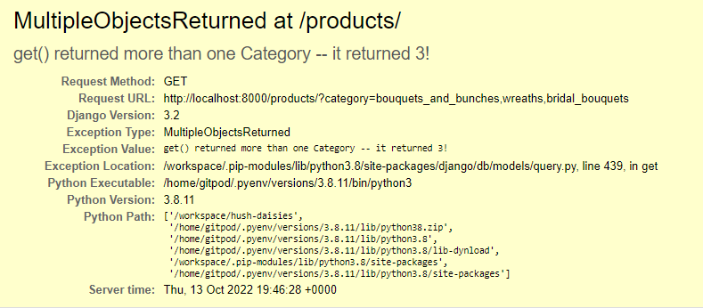

# Table of Contents 

1. [**Introduction**](#Introduction)

2. [**E-commerce Business Model**](#E-commerce-business-model)

3. [**User Experience (UX)**](#User-Experience)
    * [User goals](#User-goals)
    * [Site owner goals](#Site-owner-goals)
    * [Target audience](#Target-audience)
    * [User stories](#User-stories)
    * [Structure](#Structure)
    * [Design](#Design)

4. [**Features**](#Features)
    * [Existing Features](#Existing-Features)
    * [Features to be implemented in the future](#Features-to-be-implemented-in-the-future)

5. [**Technologies used**](#Technologies-used)

6. [**Deployment**](#Deployment)
    * [Deploying to Heroku](#Deploying-to-Heroku)
    * [Forking to GitHub Repository](#Forking-to-GitHub-Repository)
    * [Making a local clone](#Making-a-local-clone)

7. [**Testing**](#Testing)
    * [Testing Approach](#Testing-Approach)
    * [User stories testing from the UX section](#User-stories-testing-from-the-UX-section)
    * [Validator Testing](#Validator-Testing)
    * [Issues and Bugs](#Issues-and-Bugs)

8. [**Credits**](#Credits)

9. [**Acknowledgments**](#Acknowledgments)

10. [**Disclaimer**](#Disclaimer)

<br>

# Hush Daisies

[Live site](https://hush-daisies.herokuapp.com/)


## Introduction
---

Hush Daisies is a B2C e-commerce website for an independent LGBTQ owned florist studio based in north Co. Dublin selling dried flower arrangements. Their small catalouge includes home decor designs, seasonal wreaths and wedding bouquets. Customers can purchase ready made designs or contact the studio owners with a custom request. In addition to their flower catalouge, the studio owners offer local workshops where they teach bouquet and wreath making skills, as well as organise themed workshops to bring together local community. Customers can create own profile and keep track of their purchase history, as well as save selected workshops to their favourites. 

## E-commerce Business Model  
---

Hush Daisies website is based on the digitial Business-to-consumer (B2C) sales model, where the products are sold to customers who are individuals or households. The clear site design and attractive content satisify emotional triggers of the site visitors, and the easy payment process makes it more likely for them to make impulse buys. The brand identity is emphasized allowing for a more personal connection to the business and strenghtneing user's trust. The business owners are invested in maintainig good relationship with the customer, by allowign easy contact, accomodating sepcial requests and organising in person workshops.  

## User Experience
---
### User goals  

* to purchase a unique dried flower arrangement
* to order a custom made design for their home or special occasion
* to see a list of upcoming workshops so that they can register their interest to learn a new skill or take part in a social event
* create a user profile with saved delivery details, purchase history and list of favourite workshops

### Site owner goals  

* sell hand-made dried flower arrangements
* create custom design based on special requests received from users
* offer workshops to interested users to promote skills of dried flower arrangement
* bring together local community with in-person themed workshops in north County Dublin

### Target audience

* all flower lovers
* people looking for alternative floral decorations for their home or a special occasion
* couples looking for long lasting bouquets and decorations for their wedding day
* people driven by sustainability and care for environment
* adults interested in learning dried flower arrangement skills
* adults living locally looking to connect and socialise within a like-minded community

### User stories:

**Agile methodology:**

  The development of this project was managed with the principles of Agile methodology in mind. 
  Planned features were defined and organised into the following [Epics](https://github.com/renatabiniek/hush-daisies/milestones) at the start of the project.  
  Epics were then broken down into atomic [user stories](https://github.com/renatabiniek/hush-daisies/issues) and organised according to the MoSCoW prioritization approach. 
  Around the recommended 60% of user stories are identified as the must-have features. Further user stories were added throughout the development. 
  Only limited number of user stories was worked on, completed and tested in each iteration.

  The user stories were recorded and managed via the Github issues functionality and the Projects board. 
  The board and user stories status can be viewed [here](https://github.com/users/renatabiniek/projects/3).  

  **Epics:**  
  
  **EPIC | View and Navigation**  
  
   * As a site user I can quickly learn what the site is about so that I can decide if it offers something I want.  
   * As a site user I can intuitively navigate through the site so that I can view desired content.  
   * As a site user I can see notifications about any changes I have made so that I have a clear understanding of the status of the action.
   * As a site user I can access the website on both mobile and desktop so that I can view the content anywhere.  

  **EPIC | Account**  

   * As an interested site user I can sign up for an account so that I can get access to additional site functionalities.  
   * As a registered site user I can receive a confirmation email after creating an account so that I know the registration was successful.  
   * As a registered site user I can easily log in and out so that I can access my account.  
   * As a registered user I can see my username displayed on the page after I log in so that I know the login status.  
   * As a registered site user I can reset my password so that I can recover my account access.  
  
  **EPIC | User profile**  
  
   * As a registered site user I can access my profile page so that I can view my previous orders and keep track of my purchases.  
   * As a registered site user I can access my profile page so that I can view and edit my list of saved workshops.  
   * As a registered site user I can save my default delivery details so that I can save time during checkout.  

  **EPIC | Admin**  

   * As a site admin I can add a product so that I can add new items to my store.
   * As a site admin I can edit a product so that I can keep the products information up-to-date.  
   * As a site admin I can delete a product so that I can remove items that are no longer for sale.  
   * As a site admin I can approve or block comments so that only appropriate comments are displayed.  
   * As a site admin I can add, edit and delete categories from the admin panel so that I can keep my content organised.  
   * As a site admin I can add, edit and delete workshop information so that the content is up-to-date. 
   * As a site admin I can receive and view details of requests submitted by my site's users so that  I can provide them with information they're looking for.  
   
  **EPIC | Products**  

   * As a shopper I can view a list of products so that I can select some to purchase.  
   * As a shopper I can click a product on the list so that I can view further information about the item before purchasing.  
   * As a shopper I can easily identify different product categories so that I can narrow down my search for relevant products.  
   * As a shopper I can sort the list of products so that I can easily identify find the most relevant products for me.  
   * As a shopper I can search through the list of products by name or description so that I can easily find the most relevant products for me.  
   * As a shopper I can see what I’ve searched for and the number of results so that I can quickly see whether the product is available.  

  **EPIC | Orders and payments**  
  
   * As a shopper I can add products to my shopping bag so that I can store the items until I'm ready to purchase.  
   * As a shopper I can adjust quantity of each item in my shopping bag so that I can make changes before checkout.  
   * As a shopper I can view my shopping bag so that I can check view the products and total cost of the order before checkout.  
   * As a shopper I can place an order as a guest so that I can still use the site without having to create an account.  
   * As a shopper I can easily enter my payment details so that I can checkout without problems.  
   * As a shopper I can receive an email confirmation of my order so that I can keep it for my records.  

  **EPIC | Workshops**  

   * As a site user I can view list of upcoming workshop organised by the store owner so that I can decide if they are of interest to me.  
   * As a site user I can find the date, description, cost and reviews for each workshop so that I can make an informed decision about attending.  
   * As a registered site user I can save workshops I'm interested in in my user profile so that I can come back to them later.  
   * As a registered site user I can add my review of a workshop I attended so that I can share my opinion with the business and other users.  
   * As a registered site user I can edit and remove my review of a workshop I attended so that I can update or remove information.  

  **EPIC | Marketing & SEO**  
  
   * As a site user I can sign up for a newsletter so that I can receive news and promo offers from the store owner.  
   * As the site owner I have a Facebook Business page created and linked on my site so that users can follow and interact with my store easily, and generate more business.  
   * As the site owner I have relevant SEO keywords implemented on my site and site's metadata so that the site ranks higher in search results for these keywords and generates more traffic.  
   * As the site owner I have sitemap.txt and robots.txt files created for the site so that **my site's ranking in search engine results is higher.  

  **EPIC | Contact**  

   * As a site user I can find Hush Daisies' social accounts so that I can stay up to date with their news.  
   * As a site user I can contact the business so that I can ask a question or submit a special request.  
   
  **Kanban board**  

  


### Structure:

* Wireframes

  Low fidelity mock-ups were made using [Balsamiq](https://balsamiq.com/wireframes/) to help plan and visualise the navigation design, placement of information, features, relationship between the content and usefulness. They were created for mobile and desktop screen sizes.

  The project was developed from initial wireframes and some modifications were made during the development process to assure better usability, and sufficient content.

  *Mobile:*

  [Mobile - Home](docs/wireframes/mobile/Mobile-Home.png)  
  [Mobile - SignIn](docs/wireframes/mobile/Mobile-SignIn.png)  
  [Mobile - Shop](docs/wireframes/mobile/Mobile-Shop.png)  
  [Mobile - Shopping Bag](docs/wireframes/mobile/Mobile-Shopping-Bag.png)  
  [Mobile - Checkout](docs/wireframes/mobile/Mobile-Checkout.png)  
  [Mobile - Order Confirmed](docs/wireframes/mobile/Mobile-Order-Confirmed.png)  
  [Mobile - Workshops](docs/wireframes/mobile/Mobile-Workshops.png)  
  [Mobile - Workshop Management](docs/wireframes/mobile/Mobile-Workshop-Management.png)  
  [Mobile - Product Management](docs/wireframes/mobile/Mobile-Product-Management.png)  
  [Mobile - Account](docs/wireframes/mobile/Mobile-Account.png)  
  [Mobile - Custom Request](docs/wireframes/mobile/Mobile-Custom-Request.png)  

  [Mobile - All in pdf](docs/wireframes/mobile/HushDaisies-Mobile.pdf) 
  
  *Desktop:*

  [Desktop - Home](docs/wireframes/desktop/Desktop-Home.png)  
  [Desktop - SignIn](docs/wireframes/desktop/Desktop-SignIn.png)  
  [Desktop - Shop](docs/wireframes/desktop/Desktop-Shop.png)  
  [Desktop - Shopping Bag](docs/wireframes/desktop/Desktop-Shopping-Bag.png)  
  [Desktop - Checkout](docs/wireframes/desktop/Desktop-Checkout.png)  
  [Desktop - Order Confirmed](docs/wireframes/desktop/Desktop-Order-Confirmed.png)  
  [Desktop - Workshops](docs/wireframes/desktop/Desktop-Workshops.png)  
  [Desktop - Workshop Management](docs/wireframes/desktop/Desktop-Workshop-Management.png)  
  [Desktop - Product Management](docs/wireframes/desktop/Desktop-Product-Management.png)  
  [Desktop - Account](docs/wireframes/desktop/Desktop-Account.png)  
  [Desktop - Custom Request](docs/wireframes/desktop/Desktop-Custom-Request.png)  

  [Desktop - All in pdf](docs/wireframes/desktop/HushDaisies-Desktop.pdf) 

  
* Database Schema

  A relational database was used for this project. The database consists of the following models: User (Django built-in model), UserProfileOrder, Product, Category, Order, OrderLineItem, Workshop, WorkshopTestimonials, WorkshopFavourites and Request. 
  Django AllAuth was used for user authentication. The database schema has been prepared using drawSQL. Limitations of the tool prevented accurate choice of field types (e.g. EmailField, URLField).

  **Hush Daisies database schema:**  

  


### Design: 

* **Colour scheme**  
  
  The number of chosen colours is minimal so as to not overload the site design. The colour palette consists of a couple of subdued colours that are similar to those of a dried flower bouquet. The goal was to create a calm, beautiful look that would aid the shopping experience. The main theme Charcoal shade was derived from the hero image colours using Eye Dropper and the complimentary Pastel Pink was added to the scheme using the colour scheme generator Coolors. In addition, black and white were used for text and background, for best contrast.
  
  The colour combinations have been checked and improved for accessibility using Color Contrast Accessibility Validator.

  


* **Typography**

  Open Sans is used throughout the entire website, with sans-serif as the fallback option in case the original font family isn't imported correctly for some reason. This is a clean and modern font, with a neutral but friendly appearance. It's highly legible on any screen size which is important for best shopping experience. The font was sourced from Google Fonts.


* **Imagery**

  [NEEDS UPDATE!]


## Features
---

[NEEDS UPDATE!]
 

### Existing Features

* Navigation  [NEEDS UPDATE!]

  * 
  * 

* Footer  [NEEDS UPDATE!]

  *  
  
* Home Page  [NEEDS UPDATE!]

  *  
  * [NEEDS UPDATE!]
  
* Sign Up

  * [NEEDS UPDATE!]

  
* Log In  

  * [NEEDS UPDATE!]
  
* Log Out  

  * [NEEDS UPDATE!]
  
* [NEEDS UPDATE!] 
  
  * 


### Features to be implemented in the future

* [NEEDS UPDATE!]

## Technologies used
---

### Languages 

* HTML
* CSS
* JavaScript
* Python (with Django framework)
* Django templating language 


### Frameworks, Libraries, Programmes and Tools 
 
* [Django web framework](https://www.djangoproject.com/) - used to build the project
* [Bootstrap 4.6](https://getbootstrap.com/docs/4.6/getting-started/introduction/) - for responsiveness, layout, modals, and general frontend style
* [AWS](https://aws.amazon.com/) - to host media and static files 
* [django-allauth](https://django-allauth.readthedocs.io/en/latest/index.html) - for user registration and authentication
* [Code Institute Template](https://github.com/Code-Institute-Org/python-essentials-template) - to display and run the command line terminal in the browser
* [drawSQL](https://drawsql.app/) - to create the database diagram model
* [Balsamiq](https://balsamiq.com/) - to create wireframes for the site as part of the preparation work for the project
* [Google Fonts](https://fonts.google.com/) - to import Open Sans font into the HTML file which was then used throughout the site
* [Coolors](https://coolors.co/ ) - to create cohesive colour scheme for the site
* [Eye Dropper](https://eyedropper.org/) - to pick specific colours from images 
* [Favicon.io](https://favicon.io/) - to create a favicon for the site
* [NEEDS UPDATE!] - to edit and resize images
* [Chrome DevTools](https://developer.chrome.com/docs/devtools/) - to inspect and debug the code through all stages of the development
* [Unicorn Revealer](https://chrome.google.com/webstore/detail/unicorn-revealer/lmlkphhdlngaicolpmaakfmhplagoaln?hl=en-GB) - to inspect the site for overflow 
* [Lighthouse](https://developers.google.com/web/tools/lighthouse) - to audit the site for performance, accessibility, SEO and best practices
* [Am I Responsive](http://ami.responsivedesign.is/) - to produce a preview of the site on different devices
* [W3C HTML Validator](https://validator.w3.org/) - to validate HTML code
* [W3C CSS Validator](https://jigsaw.w3.org/css-validator/) - to validate CSS code
* [PEP8 Online Validation Service](http://pep8online.com/) - to validate the code
* [Color Contrast Accessibility Validator](https://color.a11y.com/Contrast/) - to test the contrast and readability of colours used 
* [Heroku](https://heroku.com/) - for presenting the deployed project
* [Heroku Postgres](https://www.heroku.com/postgres) - the database for the deployed project
* [GitHub](https://github.com/) - for hosting the project code and version control 
* [GitHub issues](https://github.com/) - used as Agile tools in the planning and implementation of the project
* [Gitpod](https://gitpod.io/) - to write the code and push it to GitHub
* [Online-Spellcheck](https://www.online-spellcheck.com/) - to spellcheck the README


## Deployment [NEEDS UPDATE!]
---
### Deploying to Heroku

[Deployed program on Heroku](https://hush-daisies.herokuapp.com/)

The project was developed in GitPod, committed to Git and pushed to GitHub. 
The site was deployed to Heroku with the following steps:

  **Initial setup:**

  1. In GitPod, install Django and supporting libraries.
  2. Import the required dependencies to the requirements.txt file, using ```pip3 freeze --local > requirements.txt```
  3. Create the Django project and app.
  4. Add the app name to ```INSTALLED_APPS``` list in ```settings.py```.
  5. Migrate initial migrations created by typing in the command line ```python3 manage.py migrate```.
  6. Git add, commit and push the saved changes to GitHub. Heroku will use this file to import the dependencies that are required.

  **Deployment to Heroku:**

  1. Sign up and log in to [Heroku](https://heroku.com).
  2. On the dashboard, click **New** in the top right-hand corner and select **Create New App**.
  3. Select a *unique* name for your application and choose your region (Europe in my case).
  4. Click **Create App**.
  5. Attach the Postgres database: 
  * In the **Resources** tab, under Add-ons, type in **Postgres** and select the **Heroku Postgres** option.
  6. Navigate to the **Settings** tab (must be done before deploying code)
  7. Go to section **Config Vars**, click button **Reveal Config Vars** and press **Add** button.
  8. Add the below variables to the list: 

  * DATABASE_URL (added automatically)
  * SECRET_KEY
  * CLOUDINARY_URL

  9. Back in your code, update the ```settings.py``` file to import the env file and add the SECRET_KEY and DATABASE_URL file paths.
  10. Also in the ```settings.py``` add the following:

      Cloudinary to the INSTALLED_APPS list  

      STATICFILE_STORAGE  
      STATICFILES_DIRS  
      STATIC_ROOT  
      MEDIA_URL  
      DEFAULT_FILE_STORAGE  
      TEMPLATES_DIR  
      Update DIRS in TEMPLATES with TEMPLATES_DIR  
      Update ALLOWED_HOSTS with ['app_name.heroku.com', 'localhost']
  
  11. Store static and media files in Cloudinary:
  * Create 3 folders in the main directory; media, static and templates.
  * Create **Procfile** and add: ```web: gunicorn PROJ_NAME.wsgi```
  12. Add and commit the changes and push to GitHub.
  12. Navigate to the Deploy tab and scroll down to **Deployment Method**.
  15. Select GitHub as deployment method.
  16. Enter the name of the repository you want to connect to and click **Connect**.
  17. Select one of the deployment options - Automatic Deployments or Manual - to deploy the app.
  18. Once successfully deployed, a **View** button will appear and take you to a mock terminal.

  **Final deployment to Heroku**

  1. Ensure all files are up to date in Gitpod.
  2. Ensure DEBUG is set to FALSE in settings.py.
  3. Add "X_FRAME_OPTIONS= 'SAME ORIGIN'" to settings.py, to ensure that Summernote editor works in deployed project.
  4. Add, commit and push deployment commit to GitHub.
  5. In Heroku, go to Settings tab and click Reveal config vars. Remove DISABLE_COLLECTSTATIC variable.
  6. Go to Deploy tab and scroll down to Deploy Branch. 
  7. Run deployment and wait for confirmation that application has deployed.


  ### Forking to GitHub Repository [NEEDS UPDATE!]

  You can create a fork (copy) of the repository. This allows you to experiment with the code without affecting the original project.

  To fork the repository:

  1. Log in to your [GitHub](https://github.com/) account.
  2. On GitHub, navigate to the repository you want to fork.
  3. In the top right corner of the page, underneath your profile avatar, click **Fork**.
  4. You should now have a copy of the original repository in your GitHub account.

  ### Making a local clone

  You can clone your repository to create a local copy on your computer. Any changes made to the local copy will not affect the original project. To clone the **Hush Daisies** project, follow the steps below:

  1. Log in to your [GitHub](https://github.com/) account and locate the [Hush Daisies repository](https://github.com/renatabiniek/hush-daisies).
  2. In the repository, click on **Code** button located above all the project files.
  3. Under HTTPS, copy the link generated (https://github.com/renatabiniek/hush-daisies.git).
  4. Open the terminal you're using, e.g. Gitpod.
  5. Change the current working directory to the location where you want the cloned directory created.
  6. Type ```git clone``` and then paste the URL you copied earlier:  
  ```git clone https://github.com/renatabiniek/hush-daisies.git``` 
  7. Press **Enter** to create your local clone.

You can also refer to this [GitHub documentation](https://docs.github.com/en/github/creating-cloning-and-archiving-repositories/cloning-a-repository-from-github/cloning-a-repository) for detailed instructions. 

## Testing
---

### Testing Approach [NEEDS UPDATE!]

The site was tested manually. 
[NEEDS UPDATE!]

* **Manual testing:**

[NEEDS UPDATE!]

### User stories testing from the UX section

I tested the program considering the user stories from the UX section as well.

* [NEEDS UPDATE!]

  

### Validator Testing

* **PEP8 online**

[NEEDS UPDATE!]


* **W3C HTML Validator**

[NEEDS UPDATE!]


* **W3C CSS Validator**

[NEEDS UPDATE!]

* **JSHint**

[NEEDS UPDATE!]

* **Lighthouse**

[NEEDS UPDATE!]


* **Color contrast:**

[NEEDS UPDATE!]

* **Content:**

[NEEDS UPDATE!]

### Issues and Bugs

* **Django version not showing in requirements.txt**
  
  After an issue with my Gitpod workspace, Django v=3.2 dissapeared from the requirements.txt file. Re-installing correct version and freezing requirements again solved the issue.  

* **MEDIA_URL template tag not working**
  
  Images inserted with the {{ MEDIA_URL }} template tag were not showing. 

  **Worked:** 
  Adding "django.template.context_processors.media" to the  “context_processors” in settings.py resolved this issue.

* **Horizontal divider not displaying correctly**

  I had an issue with horizontal divider not showing up or not showing up as expected on the product page after creating the for loop. The column containing the divider was showing when inspected with the dev tools but with unexpected anchor link tag. 

  **Worked:** Found a missing closing anchor tag in the card-body section, and fixed it.

* **Could not build wheels for backports.zoneinfo**  
  
  During the initial deployment to Heroku, the build was failing due to the error:
  ERROR: Could not build wheels for backports.zoneinfo, which is required to install pyproject.toml-based projects  
  Push rejected, failed to compile Python app.  
  
  **Worked:** Changed the version in settings.py to backports.zoneinfo==0.2.1;python_version<"3.9" as per this [Stackoverflow post](https://stackoverflow.com/questions/71712258/error-could-not-build-wheels-for-backports-zoneinfo-which-is-required-to-insta)

* **Connecting Django to AWS**

  While connecting Django to S3 Bucket, static folder wasn't created and I was getting an error about MediaStorage in the deployed app. 

  **Worked:** There was a typo in my custom_storages file, I renamed the incorrect class to MediaStorage and re-deployed the project. The static folder was created correctly.  

* **Multiple objects returned**  

  

  This bug was found after adding category labels to the products list page, as well as dynamic descriptions to the search results counter. While all the labels on the product page were returning correct results and description, when *All Florals* nav link was clicked in the main navigation menu, it returned an error. I realised that using get() on the current_categories was returning a query set of categories specified in the *All Florals* link in the navbar, and not a single category as other links, therefore, it was impossible to get the category name.

  **Worked:** Adding extra conditions to the result count display for mulitple or no categories selected resolved this issue.

* **Product without category not showing on the product list when filtered**  

  I noticed that if there was no category assigned to a product, it was not being included in the product list when All florals nav link was clicked. This was due to the filter being limited to specific category names. Changed it to all products and that resolved the issue. 

* **AttributeError: 'Settings' object has no attribute 'FREE_DELIVERY_TRESHOLD'**


### Devices and browsers tested

[NEEDS UPDATE!]


### Credits

* [NEEDS UPDATE!]
* Logos for the As seen in section taken from the official sites [One Fab Day](https://onefabday.com/) and [Ireland's Homes Interior and Living](https://www.ihil.net//)
* Most of the images were sourced from [Unsplash](https://unsplash.com/):
  * [Hero image](https://unsplash.com/photos/OuWeHz4lPZg)
  * [Our studio image](https://unsplash.com/photos/p0ZvBVpW3KY)
  * [Custom orders image](https://unsplash.com/photos/XPCdZXncj64)

### Acknowledgments

Thank you to:

* [NEEDS UPDATE!]

### Disclaimer

This website is ficiotnal and has been created for educational purposes only, as part of Code Institute’s Portfolio Project 5, E-commerce Application. The requirements are to build a Full-stack site based on business logic used to control a centrally-owned dataset.

[Back to top](#Table-of-Contents)