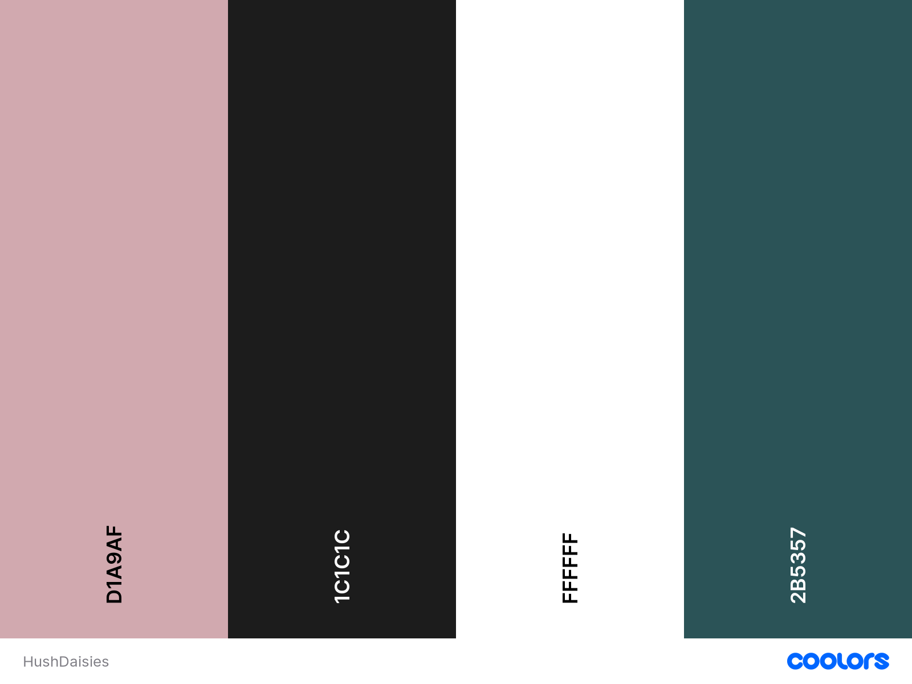

# Table of Contents 

1. [**Introduction**](#Introduction)

2. [**E-commerce Business Model**](#E-commerce-business-model)  

3. [**SEO & Web Marketing**](#SEO-and-Web-Marketing)  

4. [**User Experience (UX)**](#User-Experience)
    * [User goals](#User-goals)
    * [Site owner goals](#Site-owner-goals)
    * [Target audience](#Target-audience)
    * [User stories](#User-stories)
    * [Structure](#Structure)
    * [Design](#Design)

5. [**Features**](#Features)
    * [Existing Features](#Existing-Features)
    * [Features to be implemented in the future](#Features-to-be-implemented-in-the-future)

6. [**Technologies used**](#Technologies-used)

7. [**Deployment**](#Deployment)
    * [Deploying to Heroku](#Deploying-to-Heroku)
    * [Forking to GitHub Repository](#Forking-to-GitHub-Repository)
    * [Making a local clone](#Making-a-local-clone)

8. [**Testing**](#Testing)
    * [Testing Approach](#Testing-Approach)
    * [Testing Documentation](#Testing-Documentation)

9. [**Credits**](#Credits)

10. [**Acknowledgments**](#Acknowledgments)

11. [**Disclaimer**](#Disclaimer)

<br>

# Hush Daisies

[Live site](https://hush-daisies.herokuapp.com/)


## Introduction
---

Hush Daisies is a B2C e-commerce website for an independent LGBTQ owned florist studio based in north Co. Dublin selling dried flower arrangements. Their small catalogue includes home decor designs, seasonal wreaths and wedding bouquets. Customers can purchase ready-made designs or contact the studio owners with a custom request. In addition to their flower catalogue, the studio owners offer local workshops where they teach bouquet and wreath making skills, as well as organise themed workshops to bring together local community. Customers can create own profile and keep track of their purchase history, as well as save selected workshops to favourites. 

## E-commerce Business Model  
---

Hush Daisies website is based on the digital Business-to-consumer (B2C) sales model, where the products are sold to customers who are individuals or households. The clear site design and attractive content satisfy emotional triggers of the site visitors, and the easy payment process makes it more likely for them to make impulse buys. The brand identity is emphasized allowing for a more personal connection to the business and strengthening user's trust. The business owners are invested in maintaining good relationship with the customer, by allowing easy contact, accommodating special requests and organising in person workshops.  

## SEO and Web Marketing  
---  

### Search Engine Optimization (SEO) 

In order to ensure the website is found by search engines and ranks higher in search results, appropriate keywords have been researched and identified specifically for the Hush Daisies business type and purpose. I started with brainstorming possible keywords that could be used by potential customers in the search engines who are looking for a florist studio that crafts dried flower arrangements for home, gifts and special occasions. Not having access to a paid SEO planning platform, I utilized Google search engine to check their popularity, relevance and suggestions of other potential keywords. From my general list of all possible search terms, I narrowed it down to both short-tail and long-tail keywords that were most relevant to the site.

The keywords were implemented as follows:

* Using meta description and keywords in the head of the base.html
* Organically in the high quality content throughout the site, including hero image call out text, Our Studio & Custom Orders section, intro on the Workshop page, as well as product and workshop names  
* In the image file names and alt text

The site also includes the following elements to improve SEO:

* Privacy Policy and Terms of Use to convey trustworthiness 
* Links to trusted, relevant and high quality sites on the home page
* Attribute `rel="noopener"` on links to external websites and social media that are used to improve SEO
* Attribute `rel="nofollow"` on link of the Mailchimp logo leading to a site that should be excluded from evaluating by search engines
* Use of `strong` tags to highlight the importance of a keyword in the content
* sitemap.xml to help search engines to crawl the site and speed up content discovery
* robots.txt (listing urls that cannot be accessed by bots) to acknowledge that the site will be crawled by bots and therefore indicate that the site is of a high quality

### Web Marketing

As a small, independent business with no budget for paid marketing, I opted in for social media marketing to generate traffic to the site and brand awareness organically. This is a free method of marketing, however, it will involve significant, long-term effort involving creating and posting social media content to gain user interest, loyalty and gradually expand the audience.  

A business Facebook page was created for Hush Daisies, including relevant business information, shop action button and the link to the Hush Daisies site. First introductory post was created to encourage users to engage with the site owners and the website. The link to the FB page is included in the footer on every page of the Hush Daisies site.

Facebook might take down the page as part of their verification process but a screenshot can be found [here](docs/facebook-page.png).

Additionally, a monthly newsletter will be used as a marketing strategy, to offer special prices, drive traffic to the site and create interest around workshops. Mailchimp newsletter form has been used to add sing up input in the footer of the page. Each email address entered is added to the mailing list on the Mailchimp dashboard and can be used for mailing campaigns.

## User Experience
---
### User goals  

* to purchase a unique dried flower arrangement
* to order a custom-made design for their home or special occasion
* to see a list of upcoming workshops so that they can register their interest to learn a new skill or take part in a social event
* to create a user profile with saved delivery details, purchase history and list of favourite workshops

### Site owner goals  

* to sell hand-made dried flower arrangements
* to create custom design based on special requests received from users
* to offer workshops to interested users to promote skills of dried flower arrangement
* to bring together local community with in-person themed workshops in north County Dublin

### Target audience

* all flower lovers
* people looking for alternative floral decorations for their home or a special occasion
* couples looking for long-lasting bouquets and decorations for their wedding day
* people driven by sustainability and care for environment
* adults interested in learning dried flower arrangement skills
* adults living locally looking to connect and socialise within a like-minded community

### User stories:

**Agile methodology:**

  The development of this project was managed with the principles of Agile methodology in mind. 
  Planned features were defined and organised into the following [Epics](https://github.com/renatabiniek/hush-daisies/milestones) at the start of the project.  
  Epics were then broken down into small [user stories](https://github.com/renatabiniek/hush-daisies/issues) and organised according to the MoSCoW prioritization approach. 
  Around the recommended 60% of user stories are identified as the must-have features. Further user stories were added throughout the development. 
  Only limited number of user stories was worked on, completed and tested in each iteration.

  The user stories were recorded and managed via the Github issues functionality and the Projects board. 
  The board and user stories status can be viewed [here](https://github.com/users/renatabiniek/projects/3).  

  **Epics:**  
  
  **EPIC | View and Navigation**  
  
   * As a site user I can quickly learn what the site is about so that I can decide if it offers something I want.  
   * As a site user I can intuitively navigate through the site so that I can view desired content.  
   * As a site user I can see notifications about any changes I have made so that I have a clear understanding of the status of the action.
   * As a site user I can access the website on both mobile and desktop so that I can view the content anywhere.  
   * As a site user I can see in the site menu which page I'm currently on so that I know which part of the website I'm in.  
   * As a site user I can see in the browser which page I'm currently on so that I know which page has been opened.  
   * As a site user I can see a custom, theme-consistent 'Page not found' page when I try to access a page in error so that I how to return to the site.

  **EPIC | Account**  

   * As an interested site user I can sign up for an account so that I can get access to additional site functionalities.  
   * As a registered site user I can receive a confirmation email after creating an account so that I know the registration was successful.  
   * As a registered site user I can easily log in and out so that I can access my account.  
   * As a registered user I can see my username displayed on the page after I log in so that I know the login status.  
   * As a registered site user I can reset my password so that I can recover my account access.  
  
  **EPIC | User profile**  
  
   * As a registered site user I can access my profile page so that I can view my previous orders and keep track of my purchases.  
   * As a registered site user I can access my profile page so that I can view and edit my list of saved workshops.  
   * As a registered site user I can save my default delivery details so that I can save time during checkout.  

  **EPIC | Admin**  

   * As a site admin I can add a product so that I can add new items to my store.
   * As a site admin I can edit a product so that I can keep the product information up-to-date.  
   * As a site admin I can delete a product so that I can remove items that are no longer for sale.  
   * As a site admin I can approve or block comments so that only appropriate comments are displayed.  
   * As a site admin I can add, edit and delete categories from the admin panel so that I can keep my content organised.  
   * As a site admin I can add, edit and delete workshop information so that the content is up-to-date. 
   * As a site admin I can receive and view details of requests submitted by my site's users so that  I can provide them with information they're looking for.  
   
  **EPIC | Products**  

   * As a shopper I can view a list of products so that I can select some to purchase.  
   * As a shopper I can click a product on the list so that I can view further information about the item before purchasing.  
   * As a shopper I can easily identify different product categories so that I can narrow down my search for relevant products.  
   * As a shopper I can sort the list of products so that I can easily identify find the most relevant products for me.  
   * As a shopper I can search through the list of products by name or description so that I can easily find the most relevant products for me.  
   * As a shopper I can see what I’ve searched for and the number of results so that I can quickly see whether the product is available.  

  **EPIC | Orders and payments**  
  
   * As a shopper I can add products to my shopping bag so that I can store the items until I'm ready to purchase.  
   * As a shopper I can adjust quantity of each item in my shopping bag so that I can make changes before checkout.  
   * As a shopper I can view my shopping bag so that I can check view the products and total cost of the order before checkout.  
   * As a shopper I can place an order as a guest so that I can still use the site without having to create an account.  
   * As a shopper I can easily enter my payment details so that I can checkout without problems.  
   * As a shopper I can receive an email confirmation of my order so that I can keep it for my records.  
   * As a shopper I can always see the total amount in my basket while browsing the site so that I can keep track of my spend.  
   * As a shopper I can see a preview of my basket every time I make a change so that I can always see the up-to-date basket contents.  
   * As a shopper I can proceed with my payment so that I can complete my purchase.  
   * As a shopper I can receive a confirmation of my order so that I can I know the order went through correctly.  
   * As the site owner I can ensure that an order is a created once payment is made even if the checkout process is interrupted so that there is no discrepancy in database.  
   * As a registered user I can view my past orders on my profile page so that I can keep track of my past purchases.

  **EPIC | Workshops**  

   * As a site user I can view list of upcoming workshop organised by the store owner so that I can decide if they are of interest to me.  
   * As a site user I can find the date, description, cost and reviews for each workshop so that I can make an informed decision about attending.  
   * As a registered site user I can save workshops I'm interested in in my user profile so that I can come back to them later.  
   * As a registered site user I can add my review of a workshop I attended so that I can share my opinion with the business and other users.  
   * As a registered site user I can edit and remove my review of a workshop I attended so that I can update or remove information.  

  **EPIC | Marketing & SEO**  
  
   * As a site user I can sign up for a newsletter so that I can receive news and promo offers from the store owner.  
   * As the site owner I have a Facebook Business page created and linked on my site so that users can follow and interact with my store easily, and generate more business.  
   * As the site owner I have relevant SEO keywords implemented on my site and site's metadata so that the site ranks higher in search results for these keywords and generates more traffic.  
   * As the site owner I have sitemap.txt and robots.txt files created for the site so that **my site's ranking in search engine results is higher.  

  **EPIC | Contact**  

   * As a site user I can find Hush Daisies' social accounts so that I can stay up to date with their news.  
   * As a site user I can contact the business so that I can ask a question or submit a special request.  
   
  **Kanban board**  

  


### Structure:

* Wireframes

  Low fidelity mock-ups were made using [Balsamiq](https://balsamiq.com/wireframes/) to help plan and visualise the navigation design, placement of information, features, relationship between the content and usefulness. They were created for mobile and desktop screen sizes.

  The project was developed from initial wireframes and some modifications were made during the development process to assure better usability, and sufficient content.

  *Mobile:*

  [Mobile - Home](docs/wireframes/mobile/Mobile-Home.png)  
  [Mobile - SignIn](docs/wireframes/mobile/Mobile-SignIn.png)  
  [Mobile - Shop](docs/wireframes/mobile/Mobile-Shop.png)  
  [Mobile - Shopping Bag](docs/wireframes/mobile/Mobile-Shopping-Bag.png)  
  [Mobile - Checkout](docs/wireframes/mobile/Mobile-Checkout.png)  
  [Mobile - Order Confirmed](docs/wireframes/mobile/Mobile-Order-Confirmed.png)  
  [Mobile - Workshops](docs/wireframes/mobile/Mobile-Workshops.png)  
  [Mobile - Workshop Management](docs/wireframes/mobile/Mobile-Workshop-Management.png)  
  [Mobile - Product Management](docs/wireframes/mobile/Mobile-Product-Management.png)  
  [Mobile - Account](docs/wireframes/mobile/Mobile-Account.png)  
  [Mobile - Custom Request](docs/wireframes/mobile/Mobile-Custom-Request.png)  

  [Mobile - All in pdf](docs/wireframes/mobile/HushDaisies-Mobile.pdf) 
  
  *Desktop:*

  [Desktop - Home](docs/wireframes/desktop/Desktop-Home.png)  
  [Desktop - SignIn](docs/wireframes/desktop/Desktop-SignIn.png)  
  [Desktop - Shop](docs/wireframes/desktop/Desktop-Shop.png)  
  [Desktop - Shopping Bag](docs/wireframes/desktop/Desktop-Shopping-Bag.png)  
  [Desktop - Checkout](docs/wireframes/desktop/Desktop-Checkout.png)  
  [Desktop - Order Confirmed](docs/wireframes/desktop/Desktop-Order-Confirmed.png)  
  [Desktop - Workshops](docs/wireframes/desktop/Desktop-Workshops.png)  
  [Desktop - Workshop Management](docs/wireframes/desktop/Desktop-Workshop-Management.png)  
  [Desktop - Product Management](docs/wireframes/desktop/Desktop-Product-Management.png)  
  [Desktop - Account](docs/wireframes/desktop/Desktop-Account.png)  
  [Desktop - Custom Request](docs/wireframes/desktop/Desktop-Custom-Request.png)  

  [Desktop - All in pdf](docs/wireframes/desktop/HushDaisies-Desktop.pdf) 

  
* Database Schema

  A relational database was used for this project. The database consists of the following models: User (Django built-in model), UserProfileOrder, Product, Category, Order, OrderLineItem, Workshop, Level, WorkshopTestimonials, WorkshopFavourites and CustomRequest. 
  Django AllAuth was used for user authentication. The database schema has been prepared using drawSQL. Limitations of the tool prevented accurate choice of field types (e.g. EmailField, URLField).

  **Change in the schema:**

  In my Order and UserProfile I had used house_number_or_name column. Only deep into the developement process, I realised that it would not be accepted as a standard key by Stripe's prebuilt payment page with Checkout and would require setting up additional custom field. Due to time constrains this wasn't not possible for this project, so I removed the field from profile and checkout forms where it was being rendered to avoid user confusion and receiving incorrect delivery information. 

  In the Product model, I had SKU column set as a non-editable field, but again, due to the very limited timeframe, the feature to generate SKU automatically hasn't been implemented in this project. I decided not to amend the models at this point but these 2 keys are not being used at the moment. 

  **Hush Daisies database schema:**  

  


### Design: 

* **Colour scheme**  
  
  The number of chosen colours is minimal so as to not overload the site design. The colour palette consists of a couple of subdued colours that are similar to those of a dried flower bouquet. The goal was to create a calm, beautiful look that would aid the shopping experience. The main theme Charcoal shade was derived from the hero image colours using Eye Dropper and the complimentary Pastel Pink was added to the scheme using the colour scheme generator Coolors. In addition, black and white were used for text and background, for best contrast.
  
  The colour combinations have been checked and improved for accessibility using Color Contrast Accessibility Validator.

  


* **Typography**

  Open Sans is used throughout the entire website, with sans-serif as the fallback option in case the original font family isn't imported correctly for some reason. This is a clean and modern font, with a neutral but friendly appearance. It's highly legible on any screen size which is important for best shopping experience. The font was sourced from Google Fonts.


* **Imagery**

  Images, including the homepage image, have been sourced from Unsplash. They were chosen to represent the brand (hero image of dried flowers and photo of store owners holding daisies), as well as illustrate the products and workshops.  

## Features
---

The site has a clean, minimalistic design to ensure the best possible user experience for the target audience. The site is responsive on smaller screens so that it can be used on the go. Screenshots of existing and tested features can be found in the [TESTING.md](TESTING.md) file in the User Stories testing section.
 

### Existing Features

* NAVIGATION & HEADER  

  * **Navbar**
  * Conventional horizontally aligned navigation bar is present on all the pages for a consistently easy and intuitive navigation.
  * Navigation bar is always placed at the top of the page and includes a logo and website name on the left, main menu link in the middle bottom, and account and basket icons on the right.
  * The site logo is clickable and allows the user to return to the top of the homepage from any location on the site.
  * The Shop menu item is a dropdown menu showing product categories.
  * Each subitem in the Shop menu takes the user to the correctly filtered products page.
  * The relevant menu item is highlighted (underlined) to help users understand what page they are on.
  * Navigation links collapse to a hamburger menu on smaller screens.
  * **User profile and shopping basket**
    * the icons are visible on all pages  
    * they change depending on the status as follows: 
      * user profile when logged in: username is displayed on the left of the profile icon, drop down menu changes to display My Profile and Log Out options (for non-admins) and Product Management, Workshop Management, My Profile, Log Out for admins.
      * user profile when not logged in: Log In and Sign up options are displayed.
      * basket when empty: is white and displays 0.00
      * basket with items: is pink, bolder and displays the running total of all items in the basket
    * clicking the basket item takes the user to the shopping basket page
  * **Banner**
    * A banner inviting users to contact store owners with special request is displayed underneath the navbar  

* FOOTER  

  * Footer is placed at the bottom of every page.  
  * It contains social links, newsletter sign up form, terms of use, privacy policy and copyright info.
  * The links open in a new tab.
  
* HOME PAGE

  * Default page displayed when users access the website.  
  * **Hero image** - illustrates the brand, contains the store's tagline and Shop now call to action button that takes the user to the products page.  
  * Underneath the hero image, a summary section is displayed with selling points of the site, decorated with illustrative icons.
  * **Our Studio** section can be accessed either from the navigation menu or by scrolling down the home page. It includes meaningful background information about the store owners, store owner's image, an overview of what the site is about and what's on offer. It includes links to other pages on the site as well as an external link to Irish News to draw the attention to a mention about the stores. (This is fictional, added for the purposes of demonstrating SEO strategy).
  * **Custom Orders** section can be accessed either from the navigation menu or by scrolling down the home page. It encourages the visitors to get in touch with any special requests or questions, call to action Get in touch is displayed underneath the message. Decorative image is added to complement the text.
  * **As Seen In** section includes logos and links to 2 relevant, high-quality sites (SEO strategy) that open in a new tab.
  
* SIGN UP

  * Sign up page can be accessed from the drop-down menu under the profile icon in the navbar.
  * It's used to create a new account.
  * Authentication link will be emailed to the address the user provided to confirm the sign up.
  
* LOG IN  

  * Users can access this page from the drop-down menu under the profile icon in the navbar, from the Sign Up page or from the Workshop details page.
  * The login page is used to log in users with an existing account.
  * A Forgot Password link is present and allows users to reset their password.

* LOG OUT

  * The logout page is used to log out users who are signed in.

* PRODUCTS 

  * This page shows **all products marked as available** for sale by the admin, organised as series of cards.
  * Products are displayed as cards in rows of 4
  * For logged in admins, all products are shown.
  * The page can be accessed via:  
    * Shop (All florals menu item) from the navbar at the top  
    * Back to all products links, Keep shopping and Add something buttons on other pages.
  * Each product card shows the product overview info, including image, product name, category and price.
  * **Category badges** are displayed at the top of the page and when clicked show correctly filtered results. All Florals show all products.
  * Category name underneath individual product image also takes the user to the correct category results.
  * **Search box** returns searched terms entered by the user. The product page is search by title and description. The number of search results, and confirmation of the search term is displayed at the top of the page.
  * **Sorting** dropdown box allows the user to re-order the results accordingly to the chosen option.
  * Clicked product image redirect to the individual product details page.
  * If no products are made available for sale by admin, text message is shown.
  * If admin is logged in, Edit and Delete links are also displayed underneath each product card to allow quick product management.
  * Edit link takes the admin to Edit product page.
  * Delete link opens a modal with a message to confirm the deletion or cancel the action.
  * Delete button removes the product from the list and toast message confirming the deletion is shown.
  * Non-admin users cannot access edit or delete options for products - an error message will show up in a toast.

* PRODUCT DETAILS

  * This page shows **full details** of the relevant product, including image, name, category, price and description.
  * Category name when clicked redirect to the correct category filtered results.
  * There is a **quantity selector** button (-/+) that allows the user to select required quantity to add to the basket.
  * A maximum of allowed products is 20 per product. A message shows up if more than 20 is entered.
  * **Keep shopping button** and back to all products link redirect to the products page.
  * **Add to basket button** can be used to add the item to the basket. 
  * If admin is logged in, **Edit and Delete** links are displayed underneath each product description to allow quick product management.
  * These links work in the same way as on the main product page.

* SHOPPING BASKET
  
  * This page allows the user to view, edit and delete items in their shopping bag before the checkout.
  * Each product added to the basket is displayed as one line, with relevant details.
  * There is a **quantity selector** available to allow adjusting quantity of each item in the basket. 
  * **Update link** underneath updates the quantity in the basket. 
  * The subtotal changes accordingly and **toast** message with updated basket preview appears with each update. 
  * A **basket summary** including totals and delivery, as well as a message about free delivery threshold when applicable appears underneath the basket items.
  * **Bin icon** is displayed next to each item in the basket and can be clicked to delete the selected item. A toast message appears to confirm.
  * If there are no items in the basket, a message and **Add something button** appear. Once clicked, the button leads to the all products page.
  * **Keep shopping button** redirects to the products page  
  * **Secure checkout button** redirects to the checkout page  

* CHECKOUT  

  * This page allows the user to see the preview of the order, and enter their delivery information and payment details.
  * On the left, the form includes **Your Details, Delivery Details and Payment Details** sections.
  * The form is shown pre-populated if the logged in user had saved their details to the profile.
  * **Save delivery information box** when ticked saves the info to the profile.
  * If the user is not logged in, a link to create an account or login will be present.
  * **Stripe input** for payment details including card number, expiry date and CVC is visible and validates the card details entered by the user.
  * The site can be tested by using the card number 4242 4242 4242 4242 with the expiry date 04/24 and the CVC code 242.
  * A warning message informing the user of the total amount to be charged is displayed in red underneath the checkout button.
  * The **order summary** is displayed on the right with individual order lines as well as order totals.  
  * Total number of items in the basket is displayed at the top.
  * **Return to basket button** brings the user back to their basket page.
  * **Secure checkout button** confirms the payment intent, triggers payment processing and order creation. 
  * An overlay with **spinning icon** is displayed while the order is being processed to let the user know the process is running.
  * Once order has been processed successfully, success toast message and a thank you page are displayed.

* CHECKOUT SUCCESS 
  
  * This page is displayed once the checkout has been completed successfully.
  * Basket icon changes back to white, and the running total is cleared.
  * It includes a message to confirm the order number, email where confirmation was sent as well as the order summary.
  * **Keep shopping button** redirect to products page.

* WORKSHOPS  
  
  * This page presents all currently planned workshops. 
  * It includes an intro with a welcome message from the store owners, providing background information about the workshops.
  * The intro includes the username if the site visitor is logged in and a **Get in touch link** that opens the contact form.
  * There's a **sorting dropdown** available with several sorting options to allow the user to re-order the results accordingly and find the most suitable workshops.
  * The total number of currently planned workshops is shown at the top of the page, on the right-hand side.
  * The workshops are displayed as cards in rows of 2, with relevant details and images displayed for each workshop.
  * Decorative icons are used for different information type.
  * If no workshops are planned by admin, a text message is shown.
  * **Join us button** is displayed underneath each card and opens the contact form that can be used to save a spot for a selected workshop.

  * **For admins:**  
    * If admin is logged in, Edit and Delete links are displayed underneath each workshop card.  
    * Edit link takes the admin to Edit workshop page.  
    * Delete link opens a modal with a message to confirm the deletion or cancel the action.  
    * Delete button removes the workshop from the list and a toast message confirming the deletion is shown.

  * Non-admin users cannot access edit or delete options for workshops - an error message will show up in a toast. 
  * When image or workshop name are clicked, the user is redirected to workshop details page.

* WORKSHOP DETAILS, FAVOURTIES & TESTIMONIALS

  * This page includes two sections: workshop details and testimonials.
  * Full details of the selected workshop are displayed.
  * Join us button opens the contact form that allows the user to save their spot for a selected workshop.
  * Back to all workshops link is displayed at the bottom of the page and it redirects the user back to the main workshop page.

  * **For admins:**  
    * If admin is logged in, Edit and Delete links are displayed underneath the workshop details.  
    * Edit link takes the superuser to Edit workshop page. 
    * Delete link opens a modal with a message to confirm the deletion or cancel the action.  
    * Delete button removes the workshop from the list and toast message confirming the deletion is shown
    * Non-admin users cannot access edit or delete options for workshops - an error message will show up in a toast

  * **Add to favourites:**  
    * If user is logged in, there is a bookmark icon Add to favourties / Remove displayed.  
    * By clicking it the user can save or remove saved workshop from their user's profile. This allows the user to keep track of any events they might be interested in.  
    * If user is not logged in, a Sign in link is displayed instead. Once clicked, it opens sign in page.

  * **Testimonials:**
    * There is a testimonial count with an icon displayed underneath the image. It shows the total number of comments for the particular workshop.  
    * Underneath the workshop details section, testimonial section is visible. 
    * If there are no comments, a message is displayed, otherwise comments are shown in descending order, including the name of the author and the date. 
    * If user is logged in, Edit and Delete links are displayed underneath the comments they wrote.  
    * Edit link opens Edit your comment page.
    * Delete link opens a modal with a message to confirm the deletion or cancel the action.
    * Delete button removes the comment from the list and toast message confirming the deletion is shown.
    * There are no links to Edit or Delete a comment that hadn't been written by the logged in user.
    * Your comment box is visible to logged in users with Add button underneath and their username displayed above the comment box. 
    * The comment form cannot be submitted empty.
    * Once a comment is written and Add button clicked, a toast message is displayed and comment is submitted to the admin panel for review and approval. 
    * Only once approved, the new testimonial is displayed in the list of comments for the relevant workshop.
    * If user is not logged in, a Sign in link is displayed instead. Once clicked, it opens sign in page.
      
* PROFILE  

  * This page displays the users profile, with the list of their saved workshops, delivery details and a section with past orders.
  * The profile page is only available to logged in users. 

  * **Saved workshops:**
    * This section includes a small image, workshop name, date and a location for each saved workshop.
    * The workshop name is a link and it takes the users to the workshop detail page for the relevant workshop.  
    * There's a bookmark icon next to each saved workshop. When clicked, the workshop is removed from the list of favourites.

  * **My delivery details:** 
    * The form is empty or pre-populated if the user decided to tick the save my info box during the checkout.  
    * With the Update button the user can updated their saved details on the profile page.
    * The information provided here is used to autofill the delivery address during checkout.

  * **My order history:**
    * This section shows a list of past orders, in descending order, with an overview of the details.
    * The order number is truncated and when clicked it takes the user to the order confirmation page with full order details displayed.
    * A scroll bar appears when the number of order lines exceeds the container.

* PRODUCT MANAGEMENT  

  * These pages can only be accessed by an admin, otherwise an error toast message is displayed (or a Sign In page if user isn't logged in).

    * **Add a new product page:**
      * This page can be accessed from the dropdown menu under the profile icon in the navbar.
      * The form includes all relevant fields to create a new product. 
      * The form cannot be submitted empty and the mandatory fields are validated. 
      * Image files can be uploaded with the Select image button. If no image is chosen, a default placeholder image is used.
      * *Is the product for sale* check box sets the correct status of the product that determines if the product will be shown to non-admin users. 
      * Back to products button redirect to all products page.  
      * Add product button adds the product to the database and publishes it on the products list.
   * **Edit product page:**
      * This page can be accessed via the Edit link underneath the product card on the products and product details pages.
      * The fields are pre-populated with the data originally entered by the logged in user for the specific product.
      * All information can be amended, including the image which can be replaced with the Select image button.
      * Update product button updates the product and the new version is displayed in the product list.

* WORKSHOP MANAGEMENT  

  * These pages can only be accessed by an admin, otherwise an error toast message is displayed (or a Sign In page if user isn't logged in).

    * **Add a new workshop page:**
      * This page can be accessed from the dropdown menu under the profile icon in the navbar.
      * The form includes all relevant fields to create a new workshop. 
      * The form cannot be submitted empty and the mandatory fields are validated. 
      * Image files can be uploaded with the Select image button. If no image is chosen, a default placeholder image is used. 
      * Back to workshops button redirect to all workshops page  
      * Add workshop button adds the workshop to the workshop list
   * **Edit workshop page:**
     * This page can be accessed via the Edit link underneath the workshop card on the workshops and workshop details pages.
     * The fields are pre-populated with the data originally entered by the logged in user for the specific workshop.
     * All information can be amended, including the image which can be replaced with the Select image button.
     * Update button updates the workshop and the new version is displayed in the workshop list.

* BACK TO TOP

  * The button appears on all pages (of significant length), on both mobile and desktop.
  * Once clicked it brings the user to the top of the page, improving the user experience.
  
* 404 ERROR PAGE 
  
  * This is a customized page that matches the site colour palette and theme.
  * It's displayed only when error occurs or invalid links are being accessed.  
  * User is presented with the error message that includes a link to return to the home page or the shop page.  

* TOASTS 
  
  * Toast messages appear in the top right-hand corner of the screen and inform the user of actions they have performed, as well as display errors and warnings.
  * They're displayed for:
    * sign in/sign out
    * adding a product to the basket
    * editing the contents of the basket
    * placing an order
    * saving and removing workshop to/from favourties
    * adding/editing/deleting comments, products, workshops
    * updating personal details on the profile page
  * They change colour depending on message type (success, error, warning, alert).
  * When the are items in the basket, a preview of the basket is shown within the toast container, including a checkout button.
  

### Features to be implemented in the future  

Due to time constraints, I was unable to implement all planned features. In the future, I'd like to add the following:

* SKU number getting generated automatically - my plan was to have this implemented hence the SKU field in the Product model is set to non-editable, and is not getting displayed in the product add/edit forms.   

* Bookmarks on the main workshops page - I'd like to add an option to save to favourites also from the main workshops page

* Rating - adding ratings to individual products would help customers to make more informed decisions about their purchase and strengthen their trust towards the store and the products

* Viewing and managing customer queries outside of admin panel - I'd like to add an 'inbox' section on the published site from where a logged in superuser could view and reply to queries received via the contact us form.

* FAQ section - a collection of frequently asked questions about the process, available options or product care would ensure the best customer care

* Blog section - a blog would allow the site owner to publish posts about the process of collecting, drying and arranging the flowers, and help keep the users engaged and coming back to the site

## Technologies used
---

### Languages 

* HTML
* CSS
* JavaScript
* Python (with Django framework)
* Django templating language 


### Frameworks, Libraries, Programmes and Tools 
 
* [Django web framework](https://www.djangoproject.com/) - used to build the project
* [Bootstrap v4.4.1](https://getbootstrap.com/docs/4.4/getting-started/download/) - for responsiveness, layout, modals, and general frontend style
* [AWS](https://aws.amazon.com/) - to host media and static files 
* [django-allauth](https://django-allauth.readthedocs.io/en/latest/index.html) - for user registration and authentication
* [Code Institute Template](https://github.com/Code-Institute-Org/python-essentials-template) - to display and run the command line terminal in the browser
* [drawSQL](https://drawsql.app/) - to create the database diagram model
* [Balsamiq](https://balsamiq.com/) - to create wireframes for the site as part of the preparation work for the project
* [Google Fonts](https://fonts.google.com/) - to import Open Sans font into the HTML file which was then used throughout the site
* [Coolors](https://coolors.co/ ) - to create cohesive colour scheme for the site
* [Eye Dropper](https://eyedropper.org/) - to pick specific colours from images 
* [Favicon.io](https://favicon.io/) - to create a favicon for the site
* [Pixlr](https://pixlr.com/) - to edit and resize images  
* [TempMail](https://temp-mail.org/en/) - for generating temporary emails to test registration flow
* [Stripe](https://stripe.com/ie) - for handling payments
* [Privacy Policy Generator](https://www.privacypolicygenerator.info/) - to generate Privacy Policy  
* [Mailchimp](https://mailchimp.com/en-gb/) - for newsletter signup form
* [Facebook](https://www.facebook.com/) - to create Hush Daisies business site
* [Terms and Conditions Generator](https://www.termsandconditionsgenerator.com/) - to generate Terms of Use  
* [XML Sitemaps](https://www.xml-sitemaps.com/) - to generate site map  
* [Chrome DevTools](https://developer.chrome.com/docs/devtools/) - to inspect and debug the code through all stages of the development
* [Unicorn Revealer](https://chrome.google.com/webstore/detail/unicorn-revealer/lmlkphhdlngaicolpmaakfmhplagoaln?hl=en-GB) - to inspect the site for overflow 
* [Lighthouse](https://developers.google.com/web/tools/lighthouse) - to audit the site for performance, accessibility, SEO and best practices
* [Am I Responsive](http://ami.responsivedesign.is/) - to produce a preview of the site on different devices
* [W3C HTML Validator](https://validator.w3.org/) - to validate HTML code
* [W3C CSS Validator](https://jigsaw.w3.org/css-validator/) - to validate CSS code
* [Pycodestyle validator](https://pypi.org/project/pycodestyle/) - to validate the Python code
* [Color Contrast Accessibility Validator](https://color.a11y.com/Contrast/) - to test the contrast and readability of colours used 
* [Heroku](https://heroku.com/) - for presenting the deployed project
* [Heroku Postgres](https://www.heroku.com/postgres) - the database for the deployed project
* [GitHub](https://github.com/) - for hosting the project code and version control 
* [GitHub issues](https://github.com/) - used as Agile tools in the planning and implementation of the project
* [Gitpod](https://gitpod.io/) - to write the code and push it to GitHub
* [Online-Spellcheck](https://www.online-spellcheck.com/) - to spellcheck the README


## Deployment
---
### Deploying to Heroku

[Deployed site on Heroku](https://hush-daisies.herokuapp.com/)

The project was developed in GitPod, committed to Git and pushed to GitHub. 
The site was deployed to Heroku with the following steps:

  **Initial setup:**

  1. In GitPod, install Django and supporting libraries.
  2. Import the required dependencies to the requirements.txt file, using ```pip3 freeze --local > requirements.txt```
  3. Create the Django project and app.
  4. Add the app name to ```INSTALLED_APPS``` list in ```settings.py```.
  5. Migrate initial migrations created by typing in the command line ```python3 manage.py migrate```.
  6. Git add, commit and push the saved changes to GitHub. Heroku will use this file to import the dependencies that are required.

  **Deployment to Heroku:**

  1. Sign up and log in to [Heroku](https://heroku.com).
  2. On the dashboard, click **New** in the top right-hand corner and select **Create New App**.
  3. Select a *unique* name for your application and choose your region (Europe in my case).
  4. Click **Create App**.
  5. Attach the Postgres database: 
     * In the **Resources** tab, under Add-ons, type in **Postgres** and select the **Heroku Postgres** option.
  6. Navigate to the **Settings** tab (must be done before deploying code)
  7. Go to section **Config Vars**, click button **Reveal Config Vars** and press **Add** button.
  8. Add the below variables to the list: 

  * DATABASE_URL (added automatically)
  * SECRET_KEY

  9. Back in your code, update the ```settings.py``` file to import the env file and add the SECRET_KEY and DATABASE_URL file paths.
  10. Also in the ```settings.py``` update the DATABASES section so that it connects to Heroku Postgres database on the deployed site and to the development sqlite3 in the local environment:

```
    if 'DATABASE_URL' in os.environ:
      DATABASES = {
              'default': dj_database_url.parse(os.environ.get('DATABASE_URL'))
          }
    else:
        DATABASES = {
            'default': {
                'ENGINE': 'django.db.backends.sqlite3',
                'NAME': BASE_DIR / 'db.sqlite3',
            }
        }
```
   
  11. Update ALLOWED_HOSTS with ['app_name.heroku.com', 'localhost']
  12. Create **Procfile** and add: ```web: gunicorn PROJ_NAME.wsgi```
  13. Add and commit the changes and push to GitHub.
  14. Go to Heroku and in Config vars, add `DISABLE_COLLECTSTATIC` with a value of `1`, for the initial deployment.
  15. Navigate to the Deploy tab and scroll down to **Deployment Method**.
  16. Select GitHub as deployment method.
  17. Enter the name of the repository you want to connect to and click **Connect**.
  18. Select one of the deployment options - Automatic Deployments or Manual - to deploy the app.
  19. Once successfully deployed, a **View** button will appear and take you to a mock terminal.

  **Add AWS for hosting static and media files**

  1. Sign up or log in to your AWS account.
  2. From services, go to S3 and Buckets, and Create bucket. 
  3. Under 'Object Ownership' select 'ACLs enabled' and leave the Object Ownership as Bucket owner preferred.
  4. Uncheck the 'Block all public access' checkbox, accept warning that the bucket will be made public, then click create bucket.
  5. Click bucket name and go to Properties tab. Scroll down to 'Static website hosting' and click Edit. Select 'Host a static website', fill in default index.html and error.html and press Save.
  6. Go to the Permissions tab and scroll down to 'Cross-origin resource sharing (CORS)' and paste the following:  

      `[
        {
            "AllowedHeaders": [
                "Authorization"
            ],
            "AllowedMethods": [
                "GET"
            ],
            "AllowedOrigins": [
                "*"
            ],
            "ExposeHeaders": []
        }
      ]`  

  7. Also on the Permissions tab, scroll to the 'Bucket policy' section and select 'Policy generator'. AWS policy generator page opens.
  8. In Policy Type, select 'S3 Bucket Policy'. Then inside 'Principle' allow all principals by typing *.
  9. In the Action dropdown, select 'Get Object'. And in Amazon Resources Name (ARN), paste in the ARN number from the other tab.
  10. Click 'Add statement', then 'Generate Policy'. Copy the policy that's been generated and paste it into the bucket policy editor.
  11. Before pressing save, add /* at the end of the resource key (this will allow access to all resources in the bucket). Then click Save.
  12. Scroll down to Access control list (ACL) section, click edit and enable List for Everyone (public access) and accept the warning box. Click Save

  **Identify and Access Management (IAM)**

  1. After creating the bucket, create a user. From services, go to IAM and User groups, and Create group.
  2. From the sidebar click 'Policies', then 'Create policy'.
  3. Go to the JSON tab and click 'import managed policy'. Search for 'S3' and select 'AmazonS3FullAccess' and click import.
  4. In the JSON box, update the "Resource" key using the ARN:
           `"Resource": [
                "arn:aws:s3:::bucket-name",
                "arn:aws:s3:::bucket-name/*"
            ]  
          `
  5. Click 'Next: Tags', 'Next: Review', give the policy a name and click 'Create policy'.
  6. Attach the policy to the User Group by going to User Groups, choosing the group created earlier. In the Permissions tab click Add Permission and Attach policies. Find the policy just created and click Add Permission. 
  7. From the sidebar go to the Users page and click 'Add users'.
  8. Add user's name, check 'Access key - Programmatic Access', then click Next until Create user option.
  9. Download the CSV file with user's access key and secret access key. 

   **Connecting Django and AWS**  

  1. Back in your workspace, install boto3 and django-storages, freeze requirements.txt and in settings.py add 'storages' to the INSTALLED_APPS.
  2. In settings.py add the following:

  ```
      if 'USE_AWS' in os.environ:
          AWS_STORAGE_BUCKET_NAME = 'bucket-name'
          AWS_S3_REGION_NAME = 'your bucket region'
          AWS_ACCESS_KEY_ID = os.environ.get('AWS_ACCESS_KEY_ID')
          AWS_SECRET_ACCESS_KEY = os.environ.get('AWS_SECRET_ACCESS_KEY')
          AWS_S3_CUSTOM_DOMAIN = f'{AWS_STORAGE_BUCKET_NAME}.s3.amazonaws.com'

          STATICFILES_STORAGE = 'custom_storages.StaticStorage'
          STATICFILES_LOCATION = 'static'
          DEFAULT_FILE_STORAGE = 'custom_storages.MediaStorage'
          MEDIAFILES_LOCATION = 'media'

          STATIC_URL = f'https://{AWS_S3_CUSTOM_DOMAIN}/{STATICFILES_LOCATION}/'
          MEDIA_URL = f'https://{AWS_S3_CUSTOM_DOMAIN}/{MEDIAFILES_LOCATION}/'

```
  3. In Heroku, in Config Vvars add AWS_ACCESS_KEY_ID with the value generated in the CSV file earlier. Then add the key AWS_SECRET_ACCESS_KEY with the value from the CSV file. Add the key USE_AWS, and set the value to True.
  4. Remove the DISABLE_COLLECTSTAIC variable, since django should now collect static files automatically and upload them to S3.
  5. Back in the workspace, in settings.py add the following line:
     AWS_S3_CUSTOM_DOMAIN = f'{AWS_STORAGE_BUCKET_NAME}.s3.amazonaws.com'
  6. Next, in the root directory of your project create a new file 'custom_storages.py' and add the following:  
  
      ```  
      from django.conf import settings  
      from storages.backends.s3boto3 import S3Boto3Storage
      ```
  7. Underneath the import add the following:  
      ```  
      class StaticStorage(S3Boto3Storage):
          location = settings.STATICFILES_LOCATION

      class MediaStorage(S3Boto3Storage):
          location = settings.MEDIAFILES_LOCATION
      ```  
  8. Underneath the bucket config settings, define STATICFILES_LOCATION and MEDIAFILES_LOCATION:  
      ```
      STATICFILES_STORAGE = 'custom_storages.StaticStorage'
      STATICFILES_LOCATION = 'static'
      DEFAULT_FILE_STORAGE = 'custom_storages.MediaStorage'
      MEDIAFILES_LOCATION = 'media'

      # Override URLs for static and media files
      STATIC_URL = f'https://{AWS_S3_CUSTOM_DOMAIN}/{STATICFILES_LOCATION}/'
      MEDIA_URL = f'https://{AWS_S3_CUSTOM_DOMAIN}/{MEDIAFILES_LOCATION}/'
      ```

  9. Add, commit and push the changes.
  10. Back in S3, locate the bucket created earlier. Create a new folder called 'media' inside the bucket. Inside the media folder click 'Upload', 'Add files', and then select all images you're using for your site. 
  11. Then under 'Permissions' select the option 'Grant public-read access' and click upload.

  **Final deployment to Heroku**

  1. Ensure all files are up to date in Gitpod.
  2. Ensure DEBUG is set to FALSE in settings.py.
  3. Add, commit and push deployment commit to GitHub.
  4. In Heroku, go to Settings tab and click Reveal config vars. Remove DISABLE_COLLECTSTATIC variable.
  5. Go to Deploy tab and scroll down to Deploy Branch. 
  6. Run deployment and wait for confirmation that application has deployed.


  ### Forking to GitHub Repository

  You can create a fork (copy) of the repository. This allows you to experiment with the code without affecting the original project.

  To fork the repository:

  1. Log in to your [GitHub](https://github.com/) account.
  2. On GitHub, navigate to the repository you want to fork.
  3. In the top right corner of the page, underneath your profile avatar, click **Fork**.
  4. You should now have a copy of the original repository in your GitHub account.

  ### Making a local clone

  You can clone your repository to create a local copy on your computer. Any changes made to the local copy will not affect the original project. To clone the **Hush Daisies** project, follow the steps below:

  1. Log in to your [GitHub](https://github.com/) account and locate the [Hush Daisies repository](https://github.com/renatabiniek/hush-daisies).
  2. In the repository, click on **Code** button located above all the project files.
  3. Under HTTPS, copy the link generated (https://github.com/renatabiniek/hush-daisies.git).
  4. Open the terminal you're using, e.g. Gitpod.
  5. Change the current working directory to the location where you want the cloned directory created.
  6. Type ```git clone``` and then paste the URL you copied earlier:  
  ```git clone https://github.com/renatabiniek/hush-daisies.git``` 
  7. Press **Enter** to create your local clone.

You can also refer to this [GitHub documentation](https://docs.github.com/en/github/creating-cloning-and-archiving-repositories/cloning-a-repository-from-github/cloning-a-repository) for detailed instructions. 

## Testing
---

### Testing Approach

The site was tested manually. 

I tested the site regularly during the development process, and was trying to resolve any issues found at that stage before moving to the next feature. I was also checking any new additions and changes on several devices available in my household.

In the final stage of the project, I have tested the site thoroughly with automatic validators and manually on different devices and in several browsers, taking into account user stories from the UX section.  

### Testing Documentation

The full details of tests results can be found in the [TESTING.md](TESTING.md) file.  

### Credits

* Code Institute's Boutique Ado walkthrough project was used as a starting point, modified and build on during the developement
* Logos for the As seen in section taken from the official sites [One Fab Day](https://onefabday.com/) and [Ireland's Homes Interior and Living](https://www.ihil.net//)
* Most of the images were sourced from [Unsplash](https://unsplash.com/):
  * [Hero image](https://unsplash.com/photos/OuWeHz4lPZg)
  * [Our studio image](https://unsplash.com/photos/p0ZvBVpW3KY)
  * [Custom orders image](https://unsplash.com/photos/XPCdZXncj64)  
* How to check the length of a query set in a template from [this Stackoverflow post](https://stackoverflow.com/questions/10695322/django-show-the-length-of-a-queryset-in-a-template)  
* Learned more about Exception TypeError warning from [this Stackoverflow post](https://stackoverflow.com/questions/53148112/python-3-handling-error-typeerror-catching-classes-that-do-not-inherit-from-bas)  
* Solved Bootstrap button outline issue thanks to [this Stackoverflow post](https://stackoverflow.com/questions/23333231/bootstrap-button-shows-blue-outline-when-clicked)  
* Learned how to reorder fields in a form thanks [this Stackoverflow post](https://stackoverflow.com/questions/350799/how-does-django-know-the-order-to-render-form-fields)  
* Found advice on handling long URLs in [this Stackoverflow post](https://stackoverflow.com/questions/10739843/how-should-i-format-a-long-url-in-a-python-comment-and-still-be-pep8-compliant/25034769)  
* Insights on nofollow and noopener rel attrbutes were found [here](https://yoast.com/outbound-link-sponsored-nofollow-ugc-attributes/)  
* Found advice on *table row exceeding the column count established by the first row* html validation error in [this Stackoverflow post](https://stackoverflow.com/questions/7132223/a-table-row-was-2-columns-wide-and-exceeded-the-column-count-established-by-the)  
* Removed warning in JSHint validation thanks to the advice in this [Stackoverflow post](https://stackoverflow.com/questions/37247474/es6-in-jshint-jshintrc-has-esversion-but-still-getting-warning-using-atom)


### Acknowledgments

Thank you to:

* My mentors Guido Cecilio and Daisy Mc Girr for their help and advice 
* Tutor support team at Code Institute for all their help
* Naoise Gaffney for his insightful webinar on *Planning and Preparing your MS4 or PP5 - eCommerce Project*
* Slack community

### Disclaimer

This website is fictional and has been created for educational purposes only, as part of Code Institute’s Portfolio Project 5, E-commerce Application. The requirements are to build a Full-stack site based on business logic used to control a centrally-owned dataset.

[Back to top](#Table-of-Contents)