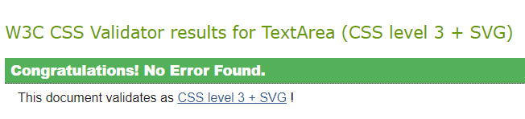

# Table of Contents 

[**Testing**](#Testing)
  * [Testing Approach](#Testing-Approach)  
  * [User stories testing from the UX section](#User-stories-testing-from-the-UX-section)  
  * [Validator Testing](#Validator-Testing)  
  * [Issues and Bugs](#Issues-and-Bugs)  
  * [Devices and Browsers Tested](#Devices-and-browsers-tested)

*This is the expanded Testing section of the full [README.md file for Hush Daisies](README.md).*

## Testing
---

### Testing Approach

The site was tested manually. 

I tested the site regularly during the development process, and was trying to resolve any issues found at that stage before moving to the next feature. I was also checking any new additions and changes on several devices available in my household.

In the final stage of the project, I have tested the site thoroughly with automatic validators and manually on different devices and in several browsers, taking into account user stories from the UX section.  

* **Manual testing:**  

The following has been tested on all pages on both mobile and desktop: visibility, links, buttons, forms, templates rendered, content.

  **Features on all pages**

  The following elements appear on all pages and have been tested as follows:

  *Navigation menu:*

  TEST RESULT: PASS

  * navbar appears on all pages, on both mobile and desktop
  * logo when clicked redirects to the home page (mobile and desktop)
  * navbar collapses to hamburger menu on mobile
  * all navbar links work and display correct pages or sections (mobile and desktop)
  * Shop menu item is a dropdown menu showing product categories
  * Each subitem in the Shop menu takes the user to the correctly filtered products page
  * Account icon with status and basket with current basket total are visible on all pages
  * Anonymous users see Log in/ Sign up options
  * Logged in users see My Profile and Log Out
  * Logged in superusers see Product Management and Workshop Management options in addition to the above

  *Footer:*

  TEST RESULT: PASS

  * appears on all pages, on both mobile and desktop
  * links to external social accounts work and open the Facebook business page for Hush Daisies, and main pages of remaining social app (on desktop they open in a new tab)  
  * Newsletter signup form is displayed and working  
  * Terms and Conditions and Privacy Policy links are displayed and open in new tab when clicked

  *Back to top:*

  TEST RESULT: PASS
  
  * appears on all pages (of significant length), on both mobile and desktop
  * brings the user to the top of the page

  **Home page**

  TEST RESULT: PASS

  * username is displayed with the relevant username on desktop
  * Show now button redirects to the Products page  
  * all links in Our Studio section are working and opening Products page, contact form, workshops page or the external Irish News page accordingly
  * Get in touch button in the Custom Orders section and Get in touch link in the banner open the contact form
  * logos in As Seen In section open relevant external sites in new tab 
  * all content is legible 

  **Products page**

  TEST RESULT: PASS

  * category badges are displayed at the top of the page and when clicked show correctly filtered results  
  * search box returns searched terms and updates the number of search results
  * sorting dropdown reorders the results accordingly to the chosen option
  * clicked image redirect to the individual product details page 
  * products are displayed as cards in rows of 4
  * if no products are made available for sale by admin, text message is shown
  * only published products are displayed to non-admins, admin sees all products regardless of the status  
  * if superuser is logged in, Edit and Delete links are displayed underneath each product card
  * Edit link takes the superuser to Edit product page
  * Delete link opens a modal with a message to confirm the deletion or cancel
  * Delete button removes the product from the list and toast message confirming the deletion is shown
  * non-admin users cannot access edit or delete options for products - an error message will show up in a toast

  **Product detail page**  

  TEST RESULT: PASS

  * full details of the relevant product is displayed on one page
  * content is legible and correctly structured
  * image or placeholder image are displayed 
  * category name when clicked redirect to the correct category filtered results
  * quantity selector button (-/+) work correctly, incrementing or decrementing the quantity
  * Keep shopping button and back to all products link redirect to the products page
  * Add to basket button adds the item to the basket
  * toast message with basket preview and checkout button is displayed  
  * View basket and checkout button takes the user to the shopping basket page  
  * if superuser is logged in, Edit and Delete links are displayed underneath each product description
  * Edit link takes the superuser to Edit product page
  * Delete link opens a modal with a message to confirm the deletion or cancel
  * Delete button removes the product from the list and toast message confirming the deletion is shown
  * non-admin users cannot access edit or delete options for products - an error message will show up in a toast

  **Shopping basket page**  

  TEST RESULT: PASS  

  * each product added to the basket is displayed as one line, with relevant details  
  * quantity selector is visible and allows adjusting quantity of each item in the basket
  * Update link updates the quantity  
  * subtotal changes accordingly and toast message with updated basket preview appears 
  * basket summary including totals and delivery, as well as a message about free delivery threshold when applicable appears underneath the basket items
  * bin icon deletes the selected item line from the basket and a toast message appears to confirm 
  * if there are no items in the basket, a message appears and Add something button that leads to the products page
  * Keep shopping button redirects to the products page  
  * Secure checkout button redirect to the checkout page

  **Checkout page**  

  TEST RESULT: PASS

  * order summary is displayed with individual order lines as well as order totals  
  * a form for personal and delivery details is displayed, and pre-populated if logged in user saved their details to the profile
  * save delivery box when ticked saves the info to the profile  
  * stripe input for payment details is visible and validates the card details entered by the user  
  * Return to basket button brings the user back to their basket page
  * Secure checkout button triggers payment processing and order creation  
  * an overlay with spinning icon is displayed while the order is being processed 
  * once order has been processed successfully, success toast message and a thank you page are displayed  
  
  **Checkout success page**  

  TEST RESULT: PASS 

  * Order number, email and order info are displayed 
  * Keep shopping button redirect to products page

 **Workshops page**  

  TEST RESULT: PASS 

  * Username is displayed in the page intro if user is logged in
  * Get in touch link in the intro opens the contact form   
  * sorting dropdown reorders the results accordingly to the chosen option  
  * number of currently planned workshops is shown at the top of the page
  * workshops are displayed as cards in rows of 2  
  * relevant details and images are displayed for each workshop
  * if no workshops are planned by admin, text message is shown
  * Join us button is displayed underneath each card and opens contact form
  * when image is clicked, the user is redirected to workshop details page
  * if superuser is logged in, Edit and Delete links are displayed underneath each workshop card  
  * Edit link takes the superuser to Edit workshop page
  * Delete link opens a modal with a message to confirm the deletion or cancel
  * Delete button removes the workshop from the list and toast message confirming the deletion is shown
  * non-admin users cannot access edit or delete options for workshops - an error message will show up in a toast
   

 **Workshops details page**  

  TEST RESULT: PASS 

  * details of the selected workshop are displayed and formatted correctly  
  * if user is logged in, there is a bookmark icon Add to favourties / Remove displayed
  * once clicked it saves or removes saved workshop from the user's profile  
  * toast message is displayed to confirm the action of adding or removing a workshop from favourites
  * if user is not logged in, a Sign in link is displayed instead. Once clicked, it opens sign in page
  * number of total comments is calculated and displayed correctly underneath the image
  * Join us button opens the contact form  
  * testimonial section is visible underneath the workshop detail section
  * if there are no comments, a message is displayed, otherwise comments are shown in descending order  
  * if user is logged in, Edit and Delete links are displayed underneath the comments they wrote
  * Edit link opens Edit your comment page  
  * Delete link opens a modal with a message to confirm the deletion or cancel
  * Delete button removes the comment from the list and toast message confirming the deletion is shown
  * there are no links to Edit or Delete a comment that hadn't been written by the logged in user  
  * Your comment box is visible to logged in users with Add button underneath  
  * comment form cannot be submitted empty
  * Once comment is written and Add button clicked, toast message is displayed and comment is submitted to the admin panel for review and approval  
  * once approved, it's displayed in the list of comments for the relevant workshop
  * if user is not logged in, a Sign in link is displayed instead. Once clicked, it opens sign in page
  * Back to all workshops link is displayed at the bottom of the page and it redirects the user back to the main workshop page
  * if superuser is logged in, Edit and Delete links are displayed underneath workshop details  
  * Edit link takes the superuser to Edit workshop page
  * Delete link opens a modal with a message to confirm the deletion or cancel
  * Delete button removes the workshop from the list and toast message confirming the deletion is shown
  * non-admin users cannot access edit or delete options for workshops - an error message will show up in a toast

 **Profile page**  

  * profile page is only available to logged in users  
  * saved workshops are displayed here with overview of relevant details  
  * workshop name is a link and takes the users to the workshop detail page for the relevant workshop  
  * bookmark icon next to each saved workshop removes the workshop from the favourites when clicked and a message is displayed as a toast to confirm  
  * My delivery details form is empty or prepopulated if the user decided to tick the save my info box during the checkout
  * Update button updates details on the profile page and during checkout. A toast message is shown to confirm the change
  * My order history section shows list of past orders, in descending order, with an overview of the details
  * order number is truncated and when clicked it takes the user to the order confirmation page with full order details displayed
  * when accessed from the profile page, the button Back to my profile is displayed on the order confirmation page which takes the user back to their profile

 **Product Management page**  

  TEST RESULT: PASS 

  * Add a new product page:
    * can only be accessed by an admin, otherwise an error toast message is displayed (or a Sign In page if user isn't logged in)
    * form cannot be submitted empty
    * mandatory fields are validated 
    * fields are validated according to their type and messages are displayed
    * files can be uploaded with the Select image button 
    * *Is the product for sale* check box sets the correct status of the product  
    * Back to products button redirect to all products page  
    * Add product button adds the product to the database - if product was marked as available, it is displayed on the list of products
    * once submitted, admin is redirected to the product details page
    * toast message is displayed to confirm the action
  * Edit product form:
    * can only be accessed by an admin, otherwise an error toast message is displayed (or a Sign In page if user isn't logged in)
    * fields are pre-populated with the data originally entered by the logged in user for the specific product
    * all information can be amended
    * image can be replaced with the Select image button
    * Update product button updates the product and the new version is displayed in the product list
    * once submitted, admin is redirected to the product details page
    * toast message is displayed to confirm the action

 **Workshop Management page**  
 
  TEST RESULT: PASS 

  * Add a new workshop page:
    * can only be accessed by an admin, otherwise an error toast message is displayed (or a Sign In page if user isn't logged in)
    * form cannot be submitted empty
    * mandatory fields are validated 
    * fields are validated according to their type and messages are displayed
    * files can be uploaded with the Select image button  
    * Back to workshops button redirect to all workshops page  
    * Add workshop button adds the workshop to the workshop list
    * once submitted, admin is redirected to the workshop details page
    * toast message is displayed to confirm the action
  * Edit workshop form:
    * can only be accessed by an admin, otherwise an error toast message is displayed (or a Sign In page if user isn't logged in)
    * fields are pre-populated with the data originally entered by the logged in user for the specific workshop
    * all information can be amended
    * image can be replaced with the Select image button
    * Update button updates the workshop and the new version is displayed in the workshop list
    * once submitted, admin is redirected to the workshop details page
    * toast message is displayed to confirm the action

  **Log In page**

  TEST RESULT: PASS

  * form is displayed and legible
  * form cannot be submitted empty
  * form cannot be submitted with incorrect details
  * Sign In button works and logs the user in, redirecting to Home page
  * link to the Sign up page redirects to the Sign up page  
  * Home button cancels signing in process and redirects to Home page
  * Forgot password link redirects to Password reset page

  **Password reset page**  
  
  * form is displayed and legible
  * form cannot be submitted empty
  * form cannot be submitted with incorrect email format  
  * Reset my password button triggers password reset email being sent to the provided email address and redirect to Password Reset confirmation page
  * an email is received at the correct email address with a link to reset the password  
  * once clicked, users is taken to Change password page where new password can be set
  
  **Log Out page**

  TEST RESULT: PASS

  * content is legible
  * Home button cancels signing out process and redirects to Home page
  * Sign Out button works, logs the user out and redirects to Home page  
  * toast message is displayed to confirm the status

  **Sign Up page**

  TEST RESULT: PASS

  * link to the Sign in page redirects to the Sign in page  
  * form is displayed and legible 
  * form cannot be submitted empty
  * form cannot be submitted with non matching passwords or with passwords that don't meet certain criteria
  * once Sign Up button is clicked it redirects the user to Verify your email page 
  * email is received at the provided email address with a link to verify the email
  * once clicked, user is take to Confirm email address page with email address displayed and a Confirm button  
  * once Confirm button is clicked, success toast message and Sign In form are displayed where the user can sign in

  **404 Error page**

  TEST RESULT: PASS

  * displayed when user tries to access an incorrect, restricted or non-existing page 
  * content is legible and clear
  * when hyperlink in the message is clicked, user is redirected to the home page or products page accordingly

### User stories testing from the UX section

I tested the website considering the user stories from the UX section as well.

**EPIC | View and Navigation**  
  
   * As a site user I can quickly learn what the site is about so that I can decide if it offers something I want.  
   * As a site user I can intuitively navigate through the site so that I can view desired content.  
   * As a site user I can see notifications about any changes I have made so that I have a clear understanding of the status of the action.
   * As a site user I can access the website on both mobile and desktop so that I can view the content anywhere.  
   * As a site user I can see in the site menu which page I'm currently on so that I know which part of the website I'm in.  
   * As a site user I can see in the browser which page I'm currently on so that I know which page has been opened.  
   * As a site user I can see a custom, theme-consistent 'Page not found' page when I try to access a page in error so that I how to return to the site.

  **EPIC | Account**  

   * As an interested site user I can sign up for an account so that I can get access to additional site functionalities.  
   * As a registered site user I can receive a confirmation email after creating an account so that I know the registration was successful.  
   * As a registered site user I can easily log in and out so that I can access my account.  
   * As a registered user I can see my username displayed on the page after I log in so that I know the login status.  
   * As a registered site user I can reset my password so that I can recover my account access.  
  
  **EPIC | User profile**  
  
   * As a registered site user I can access my profile page so that I can view my previous orders and keep track of my purchases.  
   * As a registered site user I can access my profile page so that I can view and edit my list of saved workshops.  
   * As a registered site user I can save my default delivery details so that I can save time during checkout.  

  **EPIC | Admin**  

   * As a site admin I can add a product so that I can add new items to my store.
   * As a site admin I can edit a product so that I can keep the product information up-to-date.  
   * As a site admin I can delete a product so that I can remove items that are no longer for sale.  
   * As a site admin I can approve or block comments so that only appropriate comments are displayed.  
   * As a site admin I can add, edit and delete categories from the admin panel so that I can keep my content organised.  
   * As a site admin I can add, edit and delete workshop information so that the content is up-to-date. 
   * As a site admin I can receive and view details of requests submitted by my site's users so that  I can provide them with information they're looking for.  
   
  **EPIC | Products**  

   * As a shopper I can view a list of products so that I can select some to purchase.  
   * As a shopper I can click a product on the list so that I can view further information about the item before purchasing.  
   * As a shopper I can easily identify different product categories so that I can narrow down my search for relevant products.  
   * As a shopper I can sort the list of products so that I can easily identify find the most relevant products for me.  
   * As a shopper I can search through the list of products by name or description so that I can easily find the most relevant products for me.  
   * As a shopper I can see what I’ve searched for and the number of results so that I can quickly see whether the product is available.  

  **EPIC | Orders and payments**  
  
   * As a shopper I can add products to my shopping bag so that I can store the items until I'm ready to purchase.  
   * As a shopper I can adjust quantity of each item in my shopping bag so that I can make changes before checkout.  
   * As a shopper I can view my shopping bag so that I can check view the products and total cost of the order before checkout.  
   * As a shopper I can place an order as a guest so that I can still use the site without having to create an account.  
   * As a shopper I can easily enter my payment details so that I can checkout without problems.  
   * As a shopper I can receive an email confirmation of my order so that I can keep it for my records.  
   * As a shopper I can always see the total amount in my basket while browsing the site so that I can keep track of my spend.  
   * As a shopper I can see a preview of my basket every time I make a change so that I can always see the up-to-date basket contents.  
   * As a shopper I can proceed with my payment so that I can complete my purchase.  
   * As a shopper I can receive a confirmation of my order so that I can I know the order went through correctly.  
   * As the site owner I can ensure that an order is a created once payment is made even if the checkout process is interrupted so that there is no discrepancy in database.  
   * As a registered user I can view my past orders on my profile page so that I can keep track of my past purchases.

  **EPIC | Workshops**  

   * As a site user I can view list of upcoming workshop organised by the store owner so that I can decide if they are of interest to me.  
   * As a site user I can find the date, description, cost and reviews for each workshop so that I can make an informed decision about attending.  
   * As a registered site user I can save workshops I'm interested in in my user profile so that I can come back to them later.  
   * As a registered site user I can add my review of a workshop I attended so that I can share my opinion with the business and other users.  
   * As a registered site user I can edit and remove my review of a workshop I attended so that I can update or remove information.  

  **EPIC | Marketing & SEO**  
  
   * As a site user I can sign up for a newsletter so that I can receive news and promo offers from the store owner.  
   * As the site owner I have a Facebook Business page created and linked on my site so that users can follow and interact with my store easily, and generate more business.  
   * As the site owner I have relevant SEO keywords implemented on my site and site's metadata so that the site ranks higher in search results for these keywords and generates more traffic.  
   * As the site owner I have sitemap.txt and robots.txt files created for the site so that **my site's ranking in search engine results is higher.  

  **EPIC | Contact**  

   * As a site user I can find Hush Daisies' social accounts so that I can stay up to date with their news.  
   * As a site user I can contact the business so that I can ask a question or submit a special request.  
   

  

### Validator Testing

* **PEP8**  

Due to the ongoing issue with the pep8online.com website being currently down, Python code was validated with pycodestyle validator directly in the Gitpod Workspace.
Majority of errors came from Django standard files and these have been ignored.
Remaining errors were fixed, mainly *line too long (86 > 79 characters)* and *unused import* in test.py (as no automated testing was undertaken in this project).

The following warnings have not been addressed either:

 * 'checkout.signals' imported but unused in checkout apps.py - the import is being used
 *  local variable 'e' is assigned to but never used in webhooks.py - the variable is being used
 *  redefinition of unused 'handler404' in main urls.py - the handler is being used
 *  line too long (87 > 79 characters) in /products/widgets.py remained unfixed as per the recommendation of this [Stackoverflow post](https://stackoverflow.com/questions/10739843/how-should-i-format-a-long-url-in-a-python-comment-and-still-be-pep8-compliant/25034769) as it's a template URL and it could break it  

 

* **W3C HTML Validator**

During the initial HTML validation, a number of errors relating to unclosed ``, `
` and `
` elements has been identified and resolved. 
The following were also identified:

 * Duplicate ID on delete modal for testimonials for loop - this has been resolved by using {{ loop.index }} and {{testimonial_id}} to create a unique id for each modal in the loop  
 * Table row exceeding the column count established by the first row - this was caused by me adding an extra column to the table during development but no updating the table's first row. Updating the number of columns in the table fixed this.  
 * Duplicate ID id_image on Add / Edit Product and Workshops pages - this error is caused by the image upload widget and I haven't fixed it as changing the code breaks the field.
 * Following the warning that type `type="text/javascript"` is not necessary for `<script>` tags, I removed the type.

Validation was repeated after fixing the errors for each file, and no errors or warnings were found. 
Here are the final results for each page:

 **Home**  
 
 
 
 **Products**  

 

 **Product detail**  

 

 **Edit product**  

   This error is caused by the image upload widget and I haven't fixed it as changing the code breaks the field.

 

 **Add product**  

   This error is caused by the image upload widget and I haven't fixed it as changing the code breaks the field.

 

 **404 Error**  

 

 **Login**  

 

 **Logout**  

 

 **Signup**  

 

 **Basket**  

 

 **Checkout**  

 

 **Checkout success**  

 

 **Profile**  

 

 **Custom request**  

 

 **Workshops**  

 

 **Workshop details**  

 

 **Edit workshop**  

   This error is caused by the image upload widget and I haven't fixed it as changing the code breaks the field.

 

 **Add workshop**  
   This error is caused by the image upload widget and I haven't fixed it as changing the code breaks the field.

 

 **Edit testimonial**  

 

* **W3C CSS Validator**  

No errors were found during CSS validation for any of the following css files:  
base.css, profile.css, checkout.css, workshops.css

 

* **JSHint**

JavaScript code was run it through the JSHint validator as well.  
A couple of Missing semicolon errors were corrected. Warning *'template literal syntax' is only available in ES6 (use 'esversion: 6')* was displayed and fixed by adding 
`/* jshint esversion: 6 */` to the top of the script. There are no errors left.  

**Update quantity on click**  

**stripe_elements.js**  

**Back to top button**  

**Show file name once chosen for file input field on form**  

**Sorting within select dropdown box**  

**countryfield.js**  

  

**qty_input_script.html**  

* **Lighthouse**

[NEEDS UPDATE!]

Desktop Lighthouse report from Google Chrome DevTools has been run to review performance, SEO, the best practices and accessibility of the site.

* **Color contrast:**

The site was additionally tested with [Color Contrast Accessibility Validator](https://color.a11y.com/Contrast/). Initially, there were a few contrast issues found:  
  * font color on the banner  
  * font color coming from the Bootstrap text-info class on several pages  
  * asterisk color from the Mailchimp newsletter sign-up form

I've adjusted the colors and the final result on all pages is:

*No automated color contrast issues found on the webpage tested* 

 

* **Content:**

[NEEDS UPDATE!]

### Issues and Bugs

* **Django version not showing in requirements.txt**
  
  After an issue with my Gitpod workspace, Django v=3.2 disappeared from the requirements.txt file. Re-installing correct version and freezing requirements again solved the issue.  

* **MEDIA_URL template tag not working**
  
  Images inserted with the {{ MEDIA_URL }} template tag were not showing. 

  **Worked:** 
  Adding "django.template.context_processors.media" to the  “context_processors” in settings.py resolved this issue.

* **Horizontal divider not displaying correctly**

  I had an issue with horizontal divider not showing up or not showing up as expected on the product page after creating the for loop. The column containing the divider was showing when inspected with the dev tools but with unexpected anchor link tag. 

  **Worked:** Found a missing closing anchor tag in the card-body section, and fixed it.

* **Could not build wheels for backports.zoneinfo**  
  
  During the initial deployment to Heroku, the build was failing due to the error:
  ERROR: Could not build wheels for backports.zoneinfo, which is required to install pyproject.toml-based projects  
  Push rejected, failed to compile Python app.  
  
  **Worked:** Changed the version in settings.py to backports.zoneinfo==0.2.1;python_version<"3.9" as per this [Stackoverflow post](https://stackoverflow.com/questions/71712258/error-could-not-build-wheels-for-backports-zoneinfo-which-is-required-to-insta)

* **Connecting Django to AWS**

  While connecting Django to S3 Bucket, static folder wasn't created, and I was getting an error about MediaStorage in the deployed app. 

  **Worked:** There was a typo in my custom_storages file, I renamed the incorrect class to MediaStorage and re-deployed the project. The static folder was created correctly.  

* **Multiple objects returned**  

  

  This bug was found after adding category labels to the products list page, as well as dynamic descriptions to the search results counter. While all the labels on the product page were returning correct results and description, when *All Florals* nav link was clicked in the main navigation menu, it returned an error. I realised that using get() on the current_categories was returning a query set of categories specified in the *All Florals* link in the navbar, and not a single category as other links, therefore, it was impossible to get the category name.

  **Worked:** Adding extra conditions to the result count display for multiple or no categories selected resolved this issue.

* **Product without category not showing on the product list when filtered**  

  I noticed that if there was no category assigned to a product, it was not being included in the product list when All florals nav link was clicked. This was due to the filter being limited to specific category names. Changed it to all products and that resolved the issue. 

* **AttributeError: 'Settings' object has no attribute 'FREE_DELIVERY_TRESHOLD'**
  
  I was getting this error at the checkout stage after pressing the Secure Checkout button. I've double-checked that I have the correct settings and it turned out I miss-spelled "threshold".

* **Success message not displaying in toast in checkout success**  

  Once order has been placed I expected to see the toast message on the order confirmation page but it wasn't showing. It turned out I was overriding JS script from the base.html that has toast script in checkout_success.html. Adding {{ block.super }} to retain the original script resolved the issue.  

* **The 'image' attribute has no file associated with it**

  This error was solved with adding if/else statement to check if an image exists, and display a placeholder if it doesn't.

* **404 error displayed for profile page**  
  
  After implementing the functionality to save workshops to favourites, I was getting 404 error when trying to access profile page of some users, including admin. After thorough investigation and help from the tutors, I realised that this was happening when there was nothing saved to the favourites list by a user, or when the whole favourites_list was deleted at one point from the admin account. By wrapping the code in try/except block, and initialising favorites and favourties_list with None, I managed to solve this issue on current and new profiles.

* **Misaligned toast success message on checkout on mobile**  

  During testing the checkout process on mobile, I found that success toast on checkout is misaligned on very small screens. All other toast messages were getting displayed correctly, even on small screens. Finally, I realised that the issue is caused by the very long automatically generated order number that was expanding the toast container space. I decided to remove the order number from the toast message, as it is displayed on the checkout success page and sent bia email to the customer, so it didn't make sense to add it in the toast message as well.

  

* **Delete modal within for loop**  

  During HTMl validation, I got an error about duplicated IDs for delete testimonials modal. As the modal was within a for loop, it needed to have unique IDs set. This was solved by adding {{ loop.index }} and {{ testimonial.id }} to ensure each delete modal in the loop is getting assigned unique ID.

* **Negative value allowed as price in product form**  

  During manual testing the flow, I found that the form allows the admin to enter or select a negative number as product price, which was both not a good user experience and risk of posting a product at incorrect price. I fixed this by overriding the ProductForm's init method and setting a min attribute on the price field.

  

### Devices and browsers tested  

  The site has been tested on various browsers on desktop and mobile:
  
  Google Chrome
  FireFox
  Microsoft Edge
  Safari
  
  The following devices were used:
  
  HP EliteBook laptop 820 G4
  Google Pixelbook Go Chromebook
  Google Pixel 4a phone
  Samsung Galaxy A80 phone
  iPad 5th generation
  Macbook Pro
  
  Various screen sizes were tested via the Google Chrome DevTools simulator.

[Back to top](#Table-of-Contents)