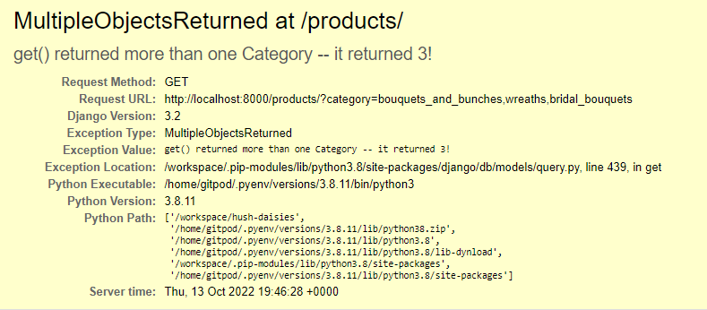

# Table of Contents 

[**Testing**](#Testing)
  * [Testing Approach](#Testing-Approach)  
  * [User stories testing from the UX section](#User-stories-testing-from-the-UX-section)  
  * [Validator Testing](#Validator-Testing)  
  * [Issues and Bugs](#Issues-and-Bugs)  
  * [Devices and Browsers Tested](#Devices-and-browsers-tested)

*This is the expanded Testing section of the full [README.md file for Hush Daisies](README.md).*

## Testing
---

### Testing Approach [NEEDS UPDATE!]

The site was tested manually. 

I tested the site regularly during the development process, and was trying to resolve any issues found at that stage before moving to the next feature. I was also checking any new additions and changes on several devices available in my household.

In the final stage of the project, I have tested the site thoroughly with automatic validators and manually on different devices and in several browsers, taking into account user stories from the UX section.  

* **Manual testing:**

[NEEDS UPDATE!]

### User stories testing from the UX section

I tested the program considering the user stories from the UX section as well.

* [NEEDS UPDATE!]

  

### Validator Testing

* **PEP8**  

Due to the ongoing issue with the pep8online.com website being currently down, Python code was validated with pycodestyle validator directly in the Gitpod Workspace.
Majority of errors came from Django standard files and these errors have been ignored.
Remaining errors were fixed, mainly mainly line too long (86 > 79 characters), unused import in test.py (as no automated testing was undertaken in this project),

 * 'checkout.signals' imported but unused in checkout apps.py
 *  local variable 'e' is assigned to but never used in webhooks.py
 *  redefinition of unused 'handler404' in main urls.py
 *  line too long (87 > 79 characters) in /products/widgets.py remained unfixed as per the recommendation of this [Stackoverflow post](https://stackoverflow.com/questions/10739843/how-should-i-format-a-long-url-in-a-python-comment-and-still-be-pep8-compliant/25034769) as it's a template URL and it could break it

[NEEDS UPDATE!]

* **W3C HTML Validator**

[NEEDS UPDATE!]

* **W3C CSS Validator**  

No errors were found during CSS validation for any of the following css files:  
base.css, profile.css, checkout.css, workshops.css

 

* **JSHint**

[NEEDS UPDATE!]

* **Lighthouse**

[NEEDS UPDATE!]

* **Color contrast:**

The site was additionally tested with [Color Contrast Accessibility Validator](https://color.a11y.com/Contrast/). Initially, there were a few contrast issues found:  
  * font color on the banner  
  * font color coming from the Bootstrap text-info class on several pages  
  * asterisk color from the Mailchimp newsletter sign-up form

I've adjusted the colors and the final result on all pages is:

*No automated color contrast issues found on the webpage tested* 

 

* **Content:**

[NEEDS UPDATE!]

### Issues and Bugs

* **Django version not showing in requirements.txt**
  
  After an issue with my Gitpod workspace, Django v=3.2 disappeared from the requirements.txt file. Re-installing correct version and freezing requirements again solved the issue.  

* **MEDIA_URL template tag not working**
  
  Images inserted with the {{ MEDIA_URL }} template tag were not showing. 

  **Worked:** 
  Adding "django.template.context_processors.media" to the  “context_processors” in settings.py resolved this issue.

* **Horizontal divider not displaying correctly**

  I had an issue with horizontal divider not showing up or not showing up as expected on the product page after creating the for loop. The column containing the divider was showing when inspected with the dev tools but with unexpected anchor link tag. 

  **Worked:** Found a missing closing anchor tag in the card-body section, and fixed it.

* **Could not build wheels for backports.zoneinfo**  
  
  During the initial deployment to Heroku, the build was failing due to the error:
  ERROR: Could not build wheels for backports.zoneinfo, which is required to install pyproject.toml-based projects  
  Push rejected, failed to compile Python app.  
  
  **Worked:** Changed the version in settings.py to backports.zoneinfo==0.2.1;python_version<"3.9" as per this [Stackoverflow post](https://stackoverflow.com/questions/71712258/error-could-not-build-wheels-for-backports-zoneinfo-which-is-required-to-insta)

* **Connecting Django to AWS**

  While connecting Django to S3 Bucket, static folder wasn't created, and I was getting an error about MediaStorage in the deployed app. 

  **Worked:** There was a typo in my custom_storages file, I renamed the incorrect class to MediaStorage and re-deployed the project. The static folder was created correctly.  

* **Multiple objects returned**  

  

  This bug was found after adding category labels to the products list page, as well as dynamic descriptions to the search results counter. While all the labels on the product page were returning correct results and description, when *All Florals* nav link was clicked in the main navigation menu, it returned an error. I realised that using get() on the current_categories was returning a query set of categories specified in the *All Florals* link in the navbar, and not a single category as other links, therefore, it was impossible to get the category name.

  **Worked:** Adding extra conditions to the result count display for multiple or no categories selected resolved this issue.

* **Product without category not showing on the product list when filtered**  

  I noticed that if there was no category assigned to a product, it was not being included in the product list when All florals nav link was clicked. This was due to the filter being limited to specific category names. Changed it to all products and that resolved the issue. 

* **AttributeError: 'Settings' object has no attribute 'FREE_DELIVERY_TRESHOLD'**
  
  I was getting this error at the checkout stage after pressing the Secure Checkout button. I've double-checked that I have the correct settings and it turned out I miss-spelled "threshold".

* **Success message not displaying in toast in checkout success**  

  Once order has been placed I expected to see the toast message on the order confirmation page but it wasn't showing. It turned out I was overriding JS script from the base.html that has toast script in checkout_success.html. Adding {{ block.super }} to retain the original script resolved the issue.  

* **The 'image' attribute has no file associated with it**

  This error was solved with adding if/else statement to check if an image exists, and display a placeholder if it doesn't.

* **404 error displayed for profile page**  
  
  After implementing the functionality to save workshops to favourites, I was getting 404 error when trying to access profile page of some users, including admin. After thorough investigation and help from the tutors, I realised that this was happening when there was nothing saved to the favourites list by a user, or when the whole favourites_list was deleted at one point from the admin account. By wrapping the code in try/except block, and initialising favorites and favourties_list with None, I managed to solve this issue on current and new profiles.

* **Misaligned toast success message on checkout on mobile**  

  During testing the checkout process on mobile, I found that success toast on checkout is misaligned on very small screens. All other toast messages were getting displayed correctly, even on small screens. Finally, I realised that the issue is caused by the very long automatically generated order number that was expanding the toast container space. I decided to remove the order number from the toast message, as it is displayed on the checkout success page and sent bia email to the customer, so it didn't make sense to add it in the toast message as well.

  

* **Delete modal within for loop**  

  During HTMl validation, I got an error about duplicated IDs for delete testimonials modal. As the modal was within a for loop, it needed to have unique IDs set. This was solved by adding {{ loop.index }} and {{ testimonial.id }} to ensure each delete modal in the loop is getting assigned unique ID.

### Devices and browsers tested  

  The site has been tested on various browsers on desktop and mobile:
  
  Google Chrome
  FireFox
  Microsoft Edge
  Safari
  
  The following devices were used:
  
  HP EliteBook laptop 820 G4
  Google Pixelbook Go Chromebook
  Google Pixel 4a phone
  Samsung Galaxy A80 phone
  iPad 5th generation
  Macbook Pro
  
  Various screen sizes were tested via the Google Chrome DevTools simulator.

[Back to top](#Table-of-Contents)